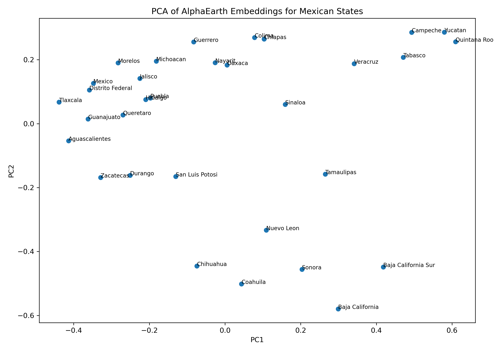

# AlphaEarth Foundations: Extracting and Analyzing Embeddings for Mexico

## Introduction

In this tutorial, we explore how to use the official **AlphaEarth Foundations** dataset available in **Google Earth Engine (GEE)**. The objective is to extract Earth embeddings for the 32 states of Mexico and analyze them using Python.

By the end of this tutorial, you will be able to:

- Access the AlphaEarth dataset.
- Explore its metadata and available years.
- Visualize embedding bands.
- Extract one 64-dimensional embedding per Mexican state.
- Export the embeddings as a CSV file.
- Analyze the embeddings using Principal Component Analysis (PCA).
- Compute similarities between states based on their embeddings.

---

# Prerequisites

Before starting, ensure that you have:

- A Google Earth Engine account.
- Access to the GEE Code Editor.
- Python 3.11 or later.
- The following Python libraries installed:

```bash
pip install pandas numpy matplotlib scikit-learn
```

---

# Load the AlphaEarth Dataset

The official AlphaEarth Foundations dataset is available as an ImageCollection.

```javascript
var embeddings = ee.ImageCollection(
    'GOOGLE/SATELLITE_EMBEDDING/V1/ANNUAL'
);
```

This dataset contains annual Earth embeddings represented by **64 embedding dimensions (A00–A63)** for every image tile.

---

# Load Mexico's Administrative Boundaries

For this example, we use the FAO GAUL administrative boundaries dataset.

```javascript
var states = ee.FeatureCollection('FAO/GAUL/2015/level1')
    .filter(ee.Filter.eq('ADM0_NAME', 'Mexico'));

print('Mexico states:', states.size());
print(states);
```

The resulting `FeatureCollection` contains the 32 Mexican states.

---

# Visualize the Embeddings

Since embeddings cannot be directly interpreted by humans, we create a false-color visualization using three embedding dimensions.

```javascript
Map.centerObject(states, 5);

var preview = embeddings
    .filterBounds(states.geometry())
    .mosaic();

Map.addLayer(
    preview.select(['A00','A01','A02']),
    {
        min: -0.3,
        max: 0.3
    },
    'AlphaEarth Preview'
);
```

You can also experiment with different combinations of embedding bands, such as:

- `A10-A20-A30`
- `A40-A50-A60`

These visualizations **do not represent RGB satellite imagery**. Instead, they visualize different dimensions of the learned latent embedding space.

---

# Explore the Dataset

The collection contains multiple years of data.

```javascript
var uniqueYears = ee.List(
    embeddings.aggregate_array('system:time_start')
        .map(function(t){
            return ee.Date(t).format('YYYY');
        })
).distinct();

print('Available years:', uniqueYears);
```

Expected output:

```text
2017
2018
2019
2020
2021
2022
2023
2024
2025
```

---

# Inspect the Native Resolution

Inspect one original AlphaEarth image.

```javascript
var firstImage = embeddings.first();

print(
    'Projection:',
    firstImage.select('A00').projection()
);

print(
    'Nominal scale:',
    firstImage.select('A00')
        .projection()
        .nominalScale()
);
```

Expected output:

- Projection: UTM (depends on the tile)
- Spatial resolution: **10 meters**

---

# Extract One Embedding per State

For every Mexican state, we compute the average embedding vector.

```javascript
var output = states.map(function(state){

    var geometry = state.geometry();

    var image = embeddings
        .filterBounds(geometry)
        .mosaic();

    var embedding = image.reduceRegion({
        reducer: ee.Reducer.mean(),
        geometry: geometry,
        scale: 100,
        maxPixels: 1e13
    });

    return ee.Feature(null, embedding)
        .set('state', state.get('ADM1_NAME'));

});

print(output);
```

Each feature now contains:

- State name
- Embedding dimensions A00–A63

---

# Export the Embeddings

Export the resulting table as a CSV file.

```javascript
Export.table.toDrive({
    collection: output,
    description: 'alphaearth_mexico_states_embeddings',
    fileFormat: 'CSV'
});
```

The exported dataset has one row per state.

| state | A00 | A01 | ... | A63 |
|------|------|------|------|------|
| Jalisco | ... | ... | ... | ... |
| Oaxaca | ... | ... | ... | ... |

---

# Load the Data in Python

```python
import pandas as pd

df = pd.read_csv("alphaearth_mexico_states_embeddings.csv")

print(df.head())
```

The dataset contains:

- 32 observations
- 64 embedding dimensions
- State names

---

# Perform Principal Component Analysis (PCA)

Since each state is represented by a 64-dimensional vector, PCA is used to reduce the dimensionality.

```python
from sklearn.decomposition import PCA

features = [f"A{i:02d}" for i in range(64)]

X = df[features]

pca = PCA(n_components=2)

components = pca.fit_transform(X)

df["PC1"] = components[:,0]
df["PC2"] = components[:,1]
```

---

# Visualize the Embedding Space

```python
import matplotlib.pyplot as plt

plt.figure(figsize=(12,8))

plt.scatter(df.PC1, df.PC2)

for _, row in df.iterrows():
    plt.text(row.PC1, row.PC2, row.state)

plt.xlabel("PC1")
plt.ylabel("PC2")
plt.title("PCA of AlphaEarth Embeddings for Mexican States")

plt.tight_layout()
plt.show()
```



**Figure 1.** PCA projection of the AlphaEarth embeddings extracted for the 32 Mexican states. Each point corresponds to one state projected from the original 64-dimensional embedding space onto the first two principal components.

The visualization reveals several meaningful geographic patterns. States belonging to the Yucatán Peninsula, such as Campeche, Yucatán, and Quintana Roo, form a compact cluster, indicating that AlphaEarth has learned similar representations for regions sharing comparable environmental and land-cover characteristics. Likewise, several northern states occupy a distinct region of the embedding space, while many central states appear relatively close to one another.

Although PCA reduces the dimensionality from 64 to only two variables, it preserves a substantial proportion of the global structure of the embedding space. This makes PCA an effective exploratory tool for identifying spatial patterns, evaluating the quality of learned representations, and comparing geographic regions before applying downstream machine learning models.

Así es exactamente como aparecerá la imagen cuando compiles el Markdown, manteniendo el mismo

This visualization projects the original 64-dimensional embedding space into two principal components.

States located close together have more similar embedding representations.

For example:

- Campeche, Yucatán, and Quintana Roo form a compact cluster.
- Northern desert states appear separated from southern tropical states.
- Central Mexican states exhibit relatively similar embeddings.

---

# Compute Similarity Between States

Embeddings can also be compared directly using cosine similarity.

```python
from sklearn.metrics.pairwise import cosine_similarity

similarity = cosine_similarity(X)
```

Convert the similarity matrix into a DataFrame.

```python
similarity_df = pd.DataFrame(
    similarity,
    index=df.state,
    columns=df.state
)

similarity_df.head()
```

Export the similarity matrix.

```python
similarity_df.to_csv(
    "alphaearth_mexico_states_similarity.csv"
)
```

This similarity matrix can be used to:

- Find the most similar states.
- Identify regional clusters.
- Compare geographic representations learned by AlphaEarth.
- Support downstream machine learning tasks.

---

# Summary

In this tutorial, we:

- Loaded the official AlphaEarth Foundations dataset.
- Explored its metadata and available years.
- Visualized different embedding dimensions.
- Extracted one 64-dimensional embedding for each Mexican state.
- Exported the embeddings as a CSV file.
- Performed Principal Component Analysis (PCA).
- Visualized the learned embedding space.
- Computed cosine similarities between state embeddings.

This workflow demonstrates a complete Earth Embedding pipeline, from data extraction in Google Earth Engine to exploratory analysis in Python. These embeddings can subsequently be used as input features for machine learning tasks such as classification, regression, clustering, and spatial similarity analysis.