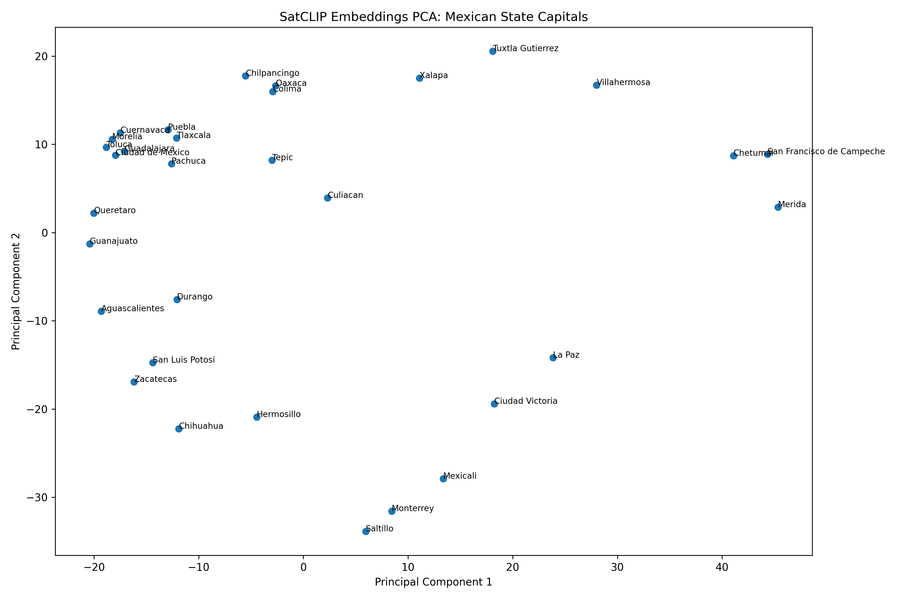
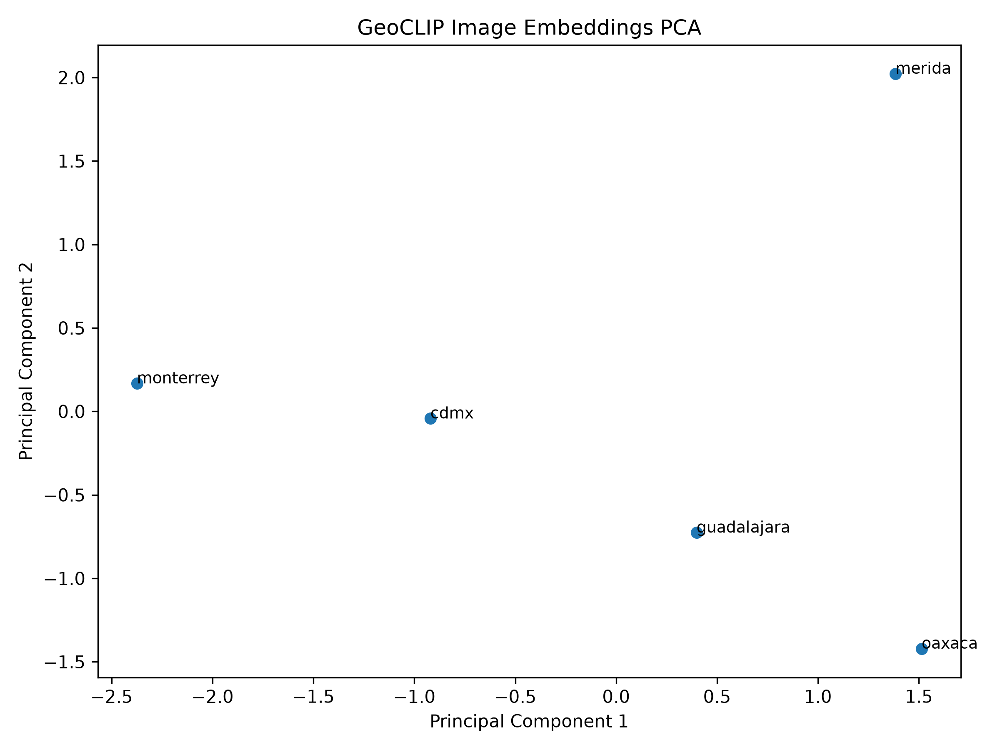
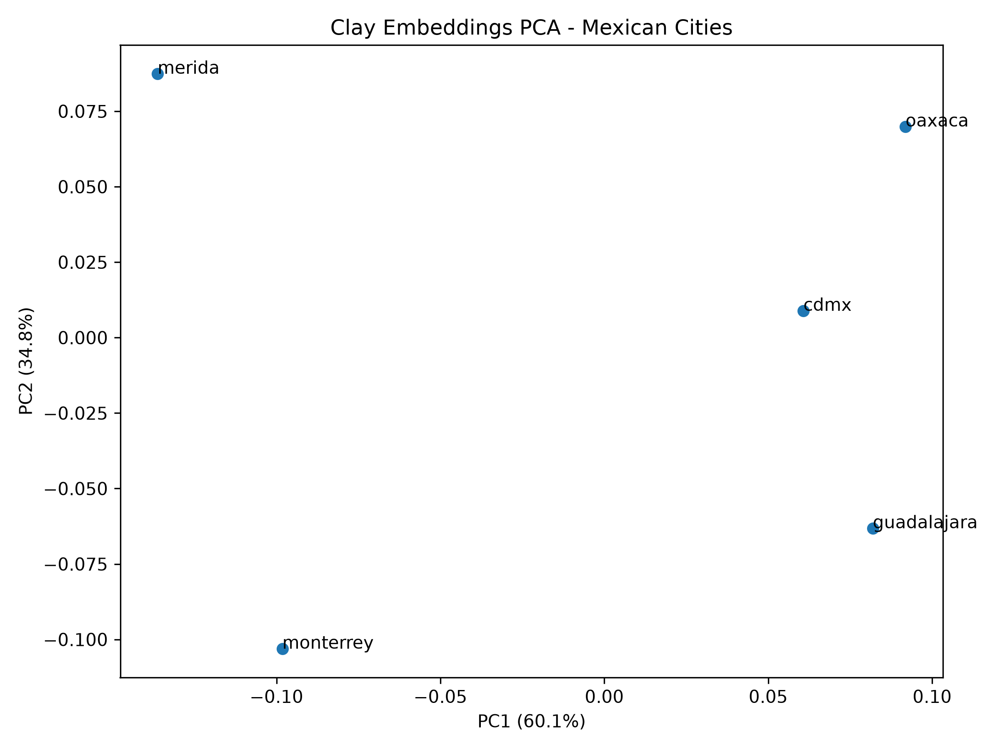
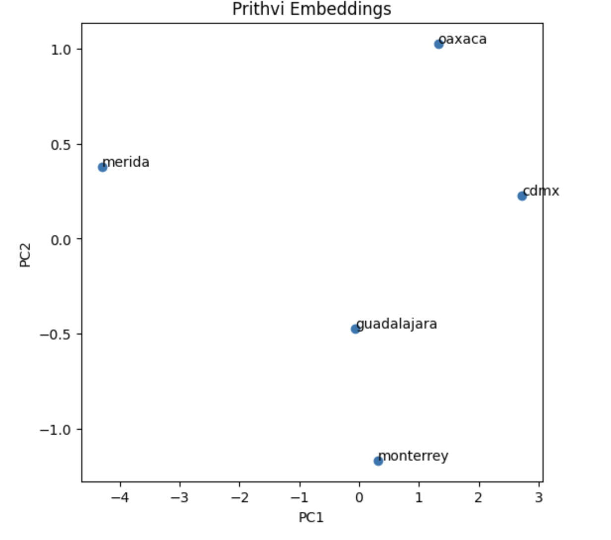
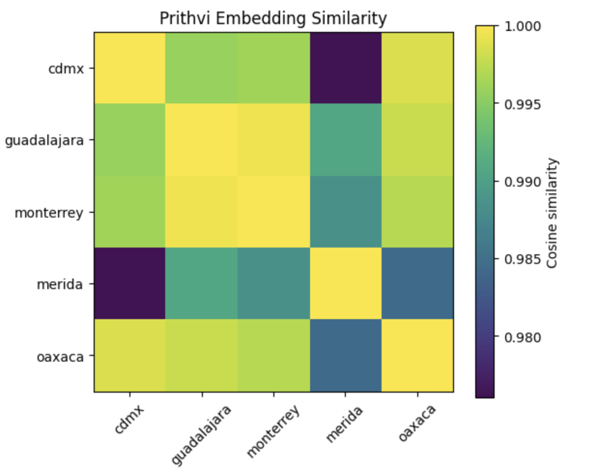

# Contexto de la organización

La presente estancia de investigación se desarrolla bajo la supervisión del Mtro. Carlos López de la Cerda, estudiante de doctorado de la Division of Computational & Data Sciences de Washington University in St. Louis, adscrito al Montgomery Lab y al Multimodal Vision Research Laboratory (MVRL).

Washington University in St. Louis es una universidad de investigación reconocida internacionalmente por sus contribuciones en ciencia de datos, inteligencia artificial, visión computacional y aprendizaje automático. Dentro de esta institución, diversos grupos de investigación trabajan en el desarrollo de nuevas metodologías para el análisis de información compleja proveniente de dominios científicos, sociales y ambientales.

La estancia forma parte del proyecto de investigación *Earth Embedding Benchmarks for Geospatial Prediction*, cuyo objetivo general es estudiar metodologías modernas de representación geoespacial mediante inteligencia artificial y evaluar su utilidad en tareas de predicción sobre unidades geográficas.

El proyecto se desarrolla en el contexto del creciente interés por los modelos fundacionales aplicados a observación terrestre, una línea de investigación que combina sensores remotos, aprendizaje profundo y análisis geoespacial para construir representaciones más eficientes de la superficie terrestre.

Dentro de este marco, la estancia tiene como propósito fortalecer la comprensión teórica y práctica de estas tecnologías, así como participar en el estudio comparativo de distintos modelos modernos de representación geoespacial.

# Descripción del problema

Durante las últimas décadas, la disponibilidad de datos de observación terrestre ha crecido de manera exponencial gracias a programas satelitales como Landsat, Sentinel-1 y Sentinel-2. Estos sistemas generan continuamente información sobre la superficie terrestre, permitiendo monitorear fenómenos relacionados con urbanización, infraestructura, agricultura, cobertura vegetal, recursos hídricos y actividad humana.

A pesar de la enorme cantidad de información disponible, el aprovechamiento efectivo de estos datos continúa representando un desafío importante. Las imágenes satelitales suelen tener una alta dimensionalidad, múltiples bandas espectrales y grandes volúmenes de almacenamiento, lo que dificulta su utilización directa en modelos estadísticos y de aprendizaje automático.

Tradicionalmente, los investigadores han abordado este problema mediante la construcción manual de variables derivadas. Por ejemplo, es común utilizar índices de vegetación, medidas de luminosidad nocturna, métricas de urbanización o características espaciales diseñadas específicamente para cada aplicación. Sin embargo, estos enfoques requieren conocimiento especializado del dominio, son difíciles de generalizar y suelen demandar un esfuerzo considerable de ingeniería de variables.

Recientemente, los avances en aprendizaje profundo han dado origen a una nueva generación de modelos capaces de aprender representaciones geoespaciales de manera automática. En lugar de diseñar manualmente características para cada problema, estos modelos buscan extraer información relevante directamente a partir de observaciones de la superficie terrestre y condensarla en representaciones compactas que puedan reutilizarse en múltiples tareas.

No obstante, debido a que se trata de un área de investigación relativamente reciente, aún existen diversas preguntas abiertas. Entre ellas destacan la comparación entre diferentes modelos de representación geoespacial, la capacidad de generalización de los *embeddings* aprendidos y su utilidad para tareas predictivas en distintos contextos geográficos.

Por esta razón, resulta necesario estudiar sistemáticamente las metodologías modernas de representación geoespacial y evaluar su desempeño bajo condiciones comparables, con el objetivo de comprender mejor sus fortalezas, limitaciones y posibles aplicaciones.

# Objetivos

## Objetivo general

Estudiar los fundamentos teóricos y prácticos de los *Earth Embeddings* modernos, así como evaluar comparativamente distintos modelos fundacionales geoespaciales para comprender su capacidad de representar información relevante de la superficie terrestre y su utilidad en tareas de predicción geoespacial.

## Objetivos específicos

- Comprender los principios fundamentales de observación terrestre (*Earth Observation*) y su relación con los modelos modernos de representación geoespacial.

- Estudiar los conceptos teóricos que sustentan los *Earth Embeddings*, incluyendo aprendizaje auto-supervisado, aprendizaje de representaciones y modelos fundacionales.

- Analizar el funcionamiento de arquitecturas utilizadas en modelos geoespaciales modernos, particularmente *Vision Transformers* (ViT) y *Masked Autoencoders* (MAE).

- Investigar las características, diferencias y aplicaciones de modelos fundacionales relevantes como *AlphaEarth*, *Clay*, *Prithvi*, *SatCLIP* y *GeoCLIP*.

- Comprender el proceso mediante el cual observaciones satelitales son transformadas en representaciones vectoriales compactas.

- Explorar el uso de *Google Earth Engine* como plataforma para consulta, visualización y procesamiento de *Earth Embeddings*.

- Replicar y analizar *benchmarks* reportados en la literatura reciente para evaluar el desempeño de distintos modelos de representación geoespacial.

- Desarrollar *pipelines* reproducibles para la extracción, integración y análisis de *embeddings* geoespaciales.

- Evaluar el potencial de los *Earth Embeddings* para tareas de predicción relacionadas con variables urbanas, socioeconómicas y de seguridad pública.

- Documentar los hallazgos obtenidos durante la estancia y generar una comprensión integral del estado actual de los modelos fundacionales geoespaciales.

# Situación actual

Durante los últimos años, los avances en aprendizaje profundo han impulsado el desarrollo de modelos fundacionales capaces de aprender representaciones generales a partir de grandes volúmenes de datos. Este paradigma ha transformado áreas como procesamiento de lenguaje natural, visión computacional y, más recientemente, observación terrestre.

En el contexto geoespacial, estos avances han dado origen a los llamados *Earth Embeddings*, representaciones vectoriales que buscan resumir información relevante sobre una ubicación geográfica dentro de un espacio de baja dimensión. En lugar de trabajar directamente con imágenes satelitales, sensores remotos o variables ambientales de alta dimensionalidad, los investigadores pueden utilizar estos *embeddings* como variables de entrada para tareas de predicción, clasificación o análisis espacial.

La investigación en *Earth Embeddings* ha crecido rápidamente durante los últimos años. Diversos trabajos han propuesto modelos capaces de aprender representaciones geoespaciales a partir de imágenes satelitales, datos climáticos, sensores remotos y coordenadas geográficas. Entre los modelos más relevantes destacan *MOSAIKS*, *SatCLIP*, *GeoCLIP*, *Clay*, *Prithvi* y *AlphaEarth Foundations*.

Aunque estos modelos comparten el objetivo general de representar información geoespacial mediante vectores compactos, difieren en aspectos importantes como la arquitectura utilizada, las fuentes de datos empleadas durante el entrenamiento, la dimensionalidad de los *embeddings* y la estrategia de aprendizaje implementada. Como consecuencia, todavía existe evidencia limitada acerca de cuáles modelos resultan más adecuados para distintos tipos de problemas.

En este contexto, han surgido trabajos recientes que buscan comparar sistemáticamente diferentes modelos de *Earth Embeddings* mediante *benchmarks* geoespaciales. Estos estudios permiten evaluar qué tan bien las representaciones aprendidas capturan información relacionada con fenómenos urbanos, ambientales, económicos y sociales.

La disponibilidad pública de modelos como *AlphaEarth* a través de *Google Earth Engine* representa una oportunidad importante para investigadores y científicos de datos, ya que permite utilizar representaciones geoespaciales avanzadas sin necesidad de entrenar modelos fundacionales desde cero.

# Planteamiento del problema desde la perspectiva de ciencia de datos

Desde la perspectiva de ciencia de datos, el problema central puede entenderse como una tarea de representación.

Sea una ubicación geográfica determinada para la cual se dispone de observaciones provenientes de imágenes satelitales, sensores remotos, variables climáticas u otras fuentes de información geoespacial. Estas observaciones pueden representarse mediante un conjunto de datos de alta dimensionalidad:

$$
X_i
$$

donde $X_i$ contiene la información observada para la ubicación $i$.

El objetivo consiste en aprender una función:

$$
f(X_i) = z_i
$$

capaz de transformar estas observaciones complejas en una representación vectorial compacta:

$$
z_i \in \mathbb{R}^{d}
$$

donde $d$ corresponde a la dimensión del *embedding*.

Idealmente, el *embedding* debe conservar la mayor cantidad posible de información relevante sobre la ubicación geográfica original, permitiendo que posteriormente pueda utilizarse para resolver tareas predictivas.

Una vez generado el *embedding*, este puede incorporarse como conjunto de covariables dentro de un modelo supervisado:

$$
y_i = g(z_i) + \varepsilon_i
$$

donde $y_i$ representa la variable objetivo y $g(\cdot)$ corresponde al modelo predictivo utilizado.

La hipótesis fundamental detrás de los *Earth Embeddings* es que estas representaciones contienen suficiente información semántica sobre el territorio para permitir la predicción de fenómenos observables como características urbanas, indicadores socioeconómicos, variables ambientales o métricas de movilidad.

Por esta razón, resulta necesario comprender cómo se generan estas representaciones, qué información capturan y bajo qué condiciones pueden utilizarse exitosamente en tareas de ciencia de datos geoespacial.

# Fundamentos teóricos

Los *Earth Embeddings* constituyen una intersección entre observación terrestre, aprendizaje profundo, representación de datos y modelos fundacionales. Para comprender su funcionamiento resulta necesario revisar los conceptos que permiten transformar observaciones geoespaciales complejas en representaciones vectoriales reutilizables.

Las siguientes secciones presentan los fundamentos técnicos más importantes para entender cómo se construyen los *embeddings* modernos utilizados en observación terrestre, incluyendo imágenes satelitales, *Vision Transformers*, aprendizaje auto-supervisado, *Masked Autoencoders* y modelos fundacionales geoespaciales.

## Earth Embeddings

Los *Earth Embeddings* son representaciones vectoriales aprendidas de ubicaciones geográficas que buscan resumir información compleja sobre la superficie terrestre en un conjunto reducido de dimensiones. Estas representaciones constituyen una extensión de la idea de *embeddings* utilizada en otras áreas de la inteligencia artificial, particularmente en procesamiento de lenguaje natural y visión computacional, donde objetos complejos son transformados en vectores numéricos que preservan relaciones relevantes dentro de los datos.

En el contexto geoespacial, el objetivo es representar una ubicación mediante un vector que capture información sobre características físicas, ambientales, urbanas y humanas observables en dicha región. En lugar de trabajar directamente con millones de pixeles provenientes de imágenes satelitales, el investigador puede utilizar una representación compacta que resume patrones relevantes del territorio.

Formalmente, puede considerarse una función:

$$
z_i = f(X_i)
$$

donde $X_i$ representa las observaciones geoespaciales disponibles para la ubicación $i$, $f(\cdot)$ corresponde al modelo de representación y $z_i$ es el *embedding* resultante.

La principal motivación detrás de los *Earth Embeddings* surge de una limitación fundamental de los datos geoespaciales modernos. Actualmente, satélites como Landsat, Sentinel-1 y Sentinel-2 generan cantidades masivas de información sobre la superficie terrestre. Aunque estos datos contienen información valiosa para estudiar fenómenos ambientales, urbanos y socioeconómicos, su tamaño y complejidad dificultan su uso directo en modelos predictivos.

Por esta razón, la comunidad de investigación ha comenzado a desarrollar modelos capaces de aprender representaciones generales de la superficie terrestre. Estas representaciones buscan conservar información relevante para múltiples tareas sin requerir que el investigador diseñe manualmente variables específicas para cada problema.

De acuerdo con Klemmer et al. (2025), los *Earth Embeddings* cumplen cuatro funciones fundamentales: compresión, fusión, interpolación e integración. Estas funciones permiten comprender por qué los *Earth Embeddings* constituyen una herramienta central dentro de la nueva generación de modelos fundacionales geoespaciales.

### Compresión

Una de las propiedades más importantes de los *Earth Embeddings* es su capacidad de compresión. Los datos geoespaciales modernos poseen una dimensionalidad extremadamente alta debido a la resolución espacial de las imágenes satelitales y al número de bandas espectrales disponibles. Una sola imagen multiespectral puede contener millones de valores numéricos distribuidos a lo largo de diferentes canales de información.

Por ejemplo, una imagen de Sentinel-2 con 13 bandas y una resolución espacial de $1000 \times 1000$ pixeles contiene aproximadamente 13 millones de observaciones individuales:

$$
13 \times 1000 \times 1000 = 13,000,000
$$

Trabajar directamente con este volumen de información resulta costoso tanto desde el punto de vista computacional como estadístico.

Los *Earth Embeddings* permiten condensar esta información en vectores compactos de pocas decenas o cientos de dimensiones. En el caso de *AlphaEarth Foundations*, una región observada mediante millones de pixeles puede representarse mediante un vector de únicamente 64 dimensiones. Esta reducción facilita el almacenamiento, la transferencia y el uso de información geoespacial dentro de modelos predictivos tradicionales.

La compresión no implica simplemente reducir el tamaño de los datos, sino preservar la información relevante sobre el territorio. El objetivo es que regiones con características similares continúen siendo reconocibles dentro del espacio de representación aun después de una reducción drástica de dimensionalidad.

### Fusión

Otra propiedad fundamental es la capacidad de fusionar múltiples modalidades de información dentro de una única representación geográfica.

Los fenómenos observados sobre la superficie terrestre rara vez pueden explicarse utilizando una sola fuente de datos. Una ciudad, por ejemplo, puede describirse simultáneamente mediante imágenes ópticas, observaciones radar, datos climáticos, información demográfica, registros administrativos o incluso texto georreferenciado.

Tradicionalmente, cada una de estas fuentes requería procesos de análisis independientes. Los investigadores debían construir variables específicas para cada modalidad y posteriormente integrarlas dentro de un mismo modelo.

Los *Earth Embeddings* buscan resolver este problema aprendiendo una representación conjunta que incorpore simultáneamente información proveniente de diferentes fuentes. De esta manera, un único vector puede capturar aspectos relacionados con infraestructura urbana, cobertura vegetal, topografía, clima y actividad humana.

Por ejemplo, una zona metropolitana no puede describirse únicamente mediante imágenes satelitales ni exclusivamente mediante datos censales. La fusión permite combinar ambos tipos de información dentro de una representación común que capture de forma más completa la complejidad del territorio.

Otro ejemplo es *AlphaEarth*, que integra información proveniente de múltiples sensores y fuentes geoespaciales para producir una única representación de cada ubicación. Esto evita que el investigador tenga que construir un *pipeline* diferente para cada modalidad de información.

### Interpolación

Los *Earth Embeddings* también permiten realizar interpolación espacial dentro de un espacio latente continuo.

En algunos modelos, particularmente aquellos basados en representaciones implícitas del espacio geográfico, es posible generar *embeddings* para coordenadas que no estuvieron presentes durante el entrenamiento. Esto significa que el modelo puede producir una representación para cualquier par de coordenadas geográficas dentro del dominio considerado.

Formalmente, dado un punto geográfico definido por:

$$
(lat, lon)
$$

el modelo puede producir un vector:

$$
z = f(lat, lon)
$$

aunque esa ubicación específica nunca haya sido observada previamente.

Esta propiedad resulta especialmente útil cuando se trabaja con regiones donde la información disponible es escasa o incompleta. Por ejemplo, si un modelo fue entrenado utilizando observaciones distribuidas sobre gran parte del territorio mexicano, podría generar representaciones para localidades específicas que no formaron parte del conjunto de entrenamiento original.

La interpolación permite consultar cualquier ubicación geográfica de manera continua, sin depender exclusivamente de una cuadrícula fija de observaciones. Esta característica amplía considerablemente las posibilidades de análisis espacial y facilita la generalización hacia nuevas regiones.

Por ejemplo, un investigador podría solicitar el *embedding* correspondiente a cualquier coordenada dentro de México, incluso si no existe una observación explícita para ese punto dentro del conjunto de entrenamiento.

### Integración

Más allá de comprimir o fusionar información, los *Earth Embeddings* buscan convertirse en una representación geográfica estándar reutilizable dentro de otros sistemas de inteligencia artificial.

Una analogía útil proviene del procesamiento de lenguaje natural. Actualmente, los modelos de lenguaje no trabajan directamente con palabras como objetos aislados, sino mediante *word embeddings* que actúan como una representación estándar del lenguaje. Diferentes arquitecturas pueden consumir estas representaciones sin necesidad de reconstruir el significado de cada palabra desde cero.

De manera similar, los *Earth Embeddings* pueden funcionar como un token geográfico universal. Una vez generado el vector asociado a una ubicación, este puede utilizarse como entrada para modelos de regresión, clasificación, agrupamiento, predicción espacial o sistemas más complejos de inteligencia artificial.

Por ejemplo, un vector generado por *AlphaEarth* podría utilizarse para predecir niveles de ingreso, incidencia delictiva, acceso a infraestructura o indicadores ambientales sin necesidad de volver a procesar las imágenes satelitales originales. El mismo *embedding* puede alimentar múltiples modelos y tareas diferentes.

Esta capacidad de integración permite que los *Earth Embeddings* actúen como una interfaz común entre observación terrestre y aprendizaje automático, facilitando el desarrollo de aplicaciones geoespaciales escalables y reutilizables.

De acuerdo con Klemmer et al. (2025), esta propiedad permite que los *Earth Embeddings* comiencen a desempeñar un papel similar al de los *word embeddings* en procesamiento de lenguaje natural: convertirse en la representación estándar utilizada por modelos posteriores para razonar sobre información geográfica.


### Importancia para la ciencia de datos geoespacial

Las cuatro funciones descritas anteriormente permiten entender por qué los *Earth Embeddings* han adquirido una relevancia creciente dentro de la ciencia de datos geoespacial.

La compresión permite manejar eficientemente grandes volúmenes de datos satelitales. La fusión facilita combinar múltiples fuentes de información dentro de una representación común. La interpolación permite generar representaciones para ubicaciones no observadas directamente. Finalmente, la integración convierte a los *Earth Embeddings* en una representación geográfica reutilizable dentro de distintos sistemas de inteligencia artificial.

En conjunto, estas propiedades convierten a los *Earth Embeddings* en una herramienta especialmente atractiva para problemas de predicción geoespacial. Una vez obtenidos los vectores de representación, estos pueden incorporarse directamente a modelos estadísticos o de aprendizaje automático, permitiendo conectar observación terrestre con aplicaciones relacionadas con urbanización, infraestructura, medio ambiente, salud pública, movilidad y condiciones socioeconómicas.

## Imágenes satelitales como insumo

Los *Earth Embeddings* no se generan directamente a partir de coordenadas geográficas ni de variables tabulares. En la mayoría de los modelos modernos, la fuente principal de información proviene de datos de observación terrestre obtenidos mediante satélites. Estas observaciones permiten capturar características físicas, ambientales y humanas de la superficie terrestre a escalas espaciales y temporales imposibles de obtener mediante trabajo de campo tradicional.

A diferencia de una fotografía convencional, una imagen satelital constituye una medición física de la radiación electromagnética reflejada o emitida por la superficie terrestre. Cada pixel representa una observación cuantitativa de un área geográfica específica, mientras que cada banda espectral registra información correspondiente a una región particular del espectro electromagnético.

Gracias a esta capacidad, los satélites pueden detectar información relacionada con vegetación, cuerpos de agua, humedad del suelo, infraestructura urbana, actividad agrícola y otros fenómenos que no siempre son visibles para el ojo humano.

### Bandas espectrales

Las imágenes satelitales modernas suelen registrar múltiples bandas espectrales simultáneamente. Cada banda captura información en una longitud de onda específica del espectro electromagnético.

Por ejemplo, los sensores ópticos pueden registrar:

- Azul (*Blue*)
- Verde (*Green*)
- Rojo (*Red*)
- Infrarrojo cercano (*Near Infrared*)
- Infrarrojo de onda corta (*Shortwave Infrared*)

Cada banda aporta información distinta sobre las características observadas en la superficie terrestre.

La vegetación saludable, por ejemplo, refleja grandes cantidades de radiación en el infrarrojo cercano mientras absorbe radiación en la banda roja debido a la presencia de clorofila. Esta diferencia permite construir índices ampliamente utilizados en observación terrestre, como el NDVI (*Normalized Difference Vegetation Index*).

Por esta razón, dos regiones que podrían parecer similares en una fotografía convencional pueden presentar patrones muy distintos cuando se observan a través de diferentes bandas espectrales.

### Representación como tensores

Desde una perspectiva computacional, una imagen satelital puede representarse como un tensor multidimensional.

Mientras que una fotografía RGB tradicional puede representarse como:

$$
H \times W \times 3
$$

donde:

- $H$ representa la altura,
- $W$ representa el ancho,
- $3$ corresponde a los canales rojo, verde y azul,

una imagen satelital multiespectral puede representarse como:

$$
H \times W \times B
$$

donde $B$ corresponde al número de bandas espectrales disponibles.

En consecuencia, las imágenes satelitales contienen considerablemente más información que una imagen convencional utilizada en tareas clásicas de visión computacional.

### El caso de Sentinel-2

Uno de los sistemas más utilizados en observación terrestre es Sentinel-2, desarrollado por la Agencia Espacial Europea (*European Space Agency*).

Sentinel-2 proporciona imágenes multiespectrales con 13 bandas distribuidas a lo largo del espectro visible, infrarrojo cercano e infrarrojo de onda corta. Dependiendo de la banda considerada, la resolución espacial puede variar entre 10, 20 y 60 metros por pixel.

Estas características permiten monitorear fenómenos relacionados con agricultura, cobertura vegetal, expansión urbana, recursos hídricos y cambios ambientales a escala global.

Debido a su cobertura gratuita, frecuencia de actualización y calidad de observación, Sentinel-2 se ha convertido en una de las principales fuentes de información para el entrenamiento de modelos fundacionales geoespaciales como *Clay*, *Prithvi* y *AlphaEarth*.

### El problema de la alta dimensionalidad

Aunque las imágenes satelitales contienen una enorme cantidad de información útil, su tamaño representa un desafío importante para la ciencia de datos.

Consideremos una imagen multiespectral de Sentinel-2 de tamaño:

$$
224 \times 224
$$

pixeles y 13 bandas espectrales.

El número total de observaciones almacenadas sería:

$$
224 \times 224 \times 13 = 652,288
$$

valores numéricos.

Sin embargo, los modelos fundacionales suelen procesar millones de imágenes de este tipo durante el entrenamiento. Como consecuencia, el volumen total de información puede alcanzar miles de millones de observaciones.

Esta alta dimensionalidad constituye una de las principales motivaciones para el desarrollo de *Earth Embeddings*. En lugar de trabajar directamente con cientos de miles o millones de valores por imagen, los modelos buscan aprender representaciones compactas capaces de conservar la información relevante para tareas posteriores.

## Cómo se producen los embeddings

Comprender qué son los *Earth Embeddings* requiere entender el proceso mediante el cual una imagen satelital es transformada en una representación vectorial compacta. Aunque los modelos modernos pueden diferir en arquitectura y fuentes de datos, la mayoría comparten una idea general: aprender automáticamente representaciones útiles a partir de observaciones geoespaciales sin depender de etiquetas humanas.

En los modelos fundacionales actuales, este proceso suele involucrar arquitecturas basadas en *Transformers* y estrategias de aprendizaje auto-supervisado. Entre las técnicas más influyentes destacan los *Vision Transformers* (*ViT*) y los *Masked Autoencoders* (*MAE*), que constituyen la base de numerosos modelos modernos de observación terrestre.

De manera simplificada, el proceso puede describirse mediante la siguiente secuencia:

$$
\text{Imagen satelital}
\rightarrow
\text{Patches}
\rightarrow
\text{Tokens}
\rightarrow
\text{Transformer}
\rightarrow
\text{Embedding}
$$

Cada una de estas etapas cumple una función específica dentro de la construcción de la representación final.

### Vision Transformers

Los *Vision Transformers* (*ViT*) representan una adaptación de la arquitectura *Transformer*, originalmente desarrollada para procesamiento de lenguaje natural, al dominio de visión computacional.

En procesamiento de lenguaje natural, un modelo *Transformer* recibe como entrada una secuencia de palabras o *tokens*. Cada palabra es transformada en una representación vectorial y posteriormente procesada mediante mecanismos de atención que permiten capturar relaciones entre elementos de la secuencia.

La idea fundamental de los *Vision Transformers* consiste en tratar una imagen como una secuencia de elementos análoga a una oración. En lugar de procesar palabras, el modelo procesa pequeñas regiones de la imagen conocidas como *patches*.

De esta manera, una imagen puede convertirse en una secuencia ordenada de representaciones que posteriormente son analizadas mediante mecanismos de atención similares a los utilizados en modelos de lenguaje.

La principal ventaja de esta aproximación es que permite capturar relaciones globales entre distintas regiones de la imagen. Mientras que las redes convolucionales tradicionales suelen enfocarse inicialmente en patrones locales, los *Vision Transformers* pueden modelar interacciones entre regiones distantes desde etapas tempranas del procesamiento.

Esta capacidad resulta particularmente valiosa en observación terrestre, donde fenómenos relevantes pueden extenderse a grandes escalas espaciales y depender de relaciones complejas entre diferentes partes del territorio.

### Patchification

Para que una imagen pueda procesarse mediante un *Vision Transformer*, primero debe transformarse en una secuencia de elementos comparables a los tokens utilizados en procesamiento de lenguaje natural.

Este procedimiento se conoce como *patchification*.

La idea consiste en dividir la imagen original en pequeños bloques de tamaño fijo denominados *patches*. Cada *patch* contiene información de una región específica de la imagen y posteriormente será convertido en un vector numérico.

Por ejemplo, consideremos una imagen de:

$$
224 \times 224
$$

pixeles.

Si se utilizan *patches* de:

$$
16 \times 16
$$

pixeles, entonces la imagen se divide en:

$$
\frac{224}{16}=14
$$

bloques por dimensión.

Como consecuencia, el número total de *patches* será:

$$
14 \times 14 = 196
$$

Cada uno de estos 196 *patches* se convierte en un token de entrada para el *Transformer*.

Este procedimiento transforma una imagen bidimensional en una secuencia ordenada de vectores, permitiendo reutilizar arquitecturas originalmente diseñadas para lenguaje natural.

Desde una perspectiva conceptual, cada *patch* funciona como una pequeña ventana de observación sobre el territorio. Algunos *patches* pueden contener vegetación, otros infraestructura urbana, cuerpos de agua o áreas agrícolas. El objetivo del modelo consiste en aprender cómo combinar esta información para construir una representación coherente de la ubicación observada.

### Positional Encoding

Una vez que la imagen ha sido dividida en *patches* y transformada en una secuencia de tokens, surge un problema importante. Los *Transformers* procesan secuencias de vectores, pero no poseen conocimiento inherente sobre la posición espacial de cada elemento dentro de la imagen.

Por ejemplo, dos secuencias que contengan exactamente los mismos *patches* pero en posiciones distintas producirían representaciones similares si no existiera información adicional sobre su ubicación original.

Para resolver este problema, los *Vision Transformers* incorporan información espacial mediante un mecanismo denominado *Positional Encoding*. Este procedimiento consiste en asociar a cada token un vector adicional que codifica su posición dentro de la imagen.

Formalmente, si $x_i$ representa el token asociado al *patch* $i$ y $p_i$ representa su codificación posicional, la entrada final al *Transformer* puede expresarse como:

$$
z_i = x_i + p_i
$$

De esta manera, el modelo recibe simultáneamente información sobre el contenido visual de cada *patch* y sobre su ubicación espacial dentro de la imagen.

La incorporación de información posicional resulta fundamental para tareas de observación terrestre, ya que la distribución espacial de los elementos observados suele contener información relevante. La ubicación relativa de cuerpos de agua, infraestructura urbana, áreas agrícolas o zonas boscosas puede modificar significativamente la interpretación de una escena geográfica.

### Self-attention

Una vez que cada *patch* ha sido transformado en un token y se ha incorporado información espacial mediante *Positional Encoding*, el modelo puede comenzar a analizar las relaciones existentes entre las diferentes regiones de la imagen. Esta tarea se realiza mediante el mecanismo denominado *self-attention*, que constituye el componente central de la arquitectura *Transformer*.

La intuición detrás del *self-attention* es relativamente sencilla. Cuando una persona observa una imagen, rara vez interpreta cada región de manera aislada. En cambio, analiza una zona considerando simultáneamente el contexto proporcionado por otras partes de la escena.

Por ejemplo, la presencia de una carretera puede adquirir significados distintos dependiendo de si se encuentra rodeada por zonas urbanas, áreas agrícolas o cuerpos de agua. De manera similar, una región con vegetación puede interpretarse de forma diferente dependiendo de los patrones observados en su entorno.

El mecanismo de *self-attention* busca replicar esta capacidad permitiendo que cada token intercambie información con todos los demás tokens de la imagen. Gracias a ello, cada *patch* puede incorporar contexto proveniente de regiones cercanas o lejanas del territorio observado.

Formalmente, cada token se transforma en tres representaciones distintas conocidas como *Query* ($Q$), *Key* ($K$) y *Value* ($V$). Estas representaciones permiten determinar qué tan relevante resulta la información contenida en un token para los demás elementos de la secuencia.

- $Q$ (*Query*) representa la información que el token desea buscar.
- $K$ (*Key*) representa la información que el token puede ofrecer.
- $V$ (*Value*) contiene la información que será transmitida.

El mecanismo de atención calcula puntuaciones de similitud entre consultas y llaves mediante:

$$
QK^T
$$

Posteriormente, estas puntuaciones son normalizadas utilizando una función *softmax*:

$$
\text{Attention}(Q,K,V)
=
\text{softmax}
\left(
\frac{QK^T}{\sqrt{d_k}}
\right)
V
$$

donde $d_k$ representa la dimensión de las llaves.

El resultado es una combinación ponderada de información proveniente de todos los tokens de entrada. Los *patches* considerados más relevantes reciben una mayor atención, mientras que aquellos menos informativos contribuyen en menor medida a la representación final.

Una característica fundamental del *self-attention* es que puede relacionar directamente regiones distantes de la imagen. A diferencia de las redes convolucionales tradicionales, que inicialmente operan sobre vecindarios locales, los *Transformers* pueden capturar dependencias globales desde las primeras capas del modelo.

En observación terrestre esta capacidad resulta especialmente valiosa. Fenómenos como expansión urbana, redes de transporte, cuencas hidrológicas o sistemas agrícolas suelen extenderse a escalas espaciales amplias. Por lo tanto, comprender relaciones entre regiones alejadas puede ser tan importante como analizar patrones locales.

### Multi-head attention

En la práctica, los modelos modernos no utilizan un único mecanismo de atención, sino múltiples mecanismos funcionando simultáneamente. Esta estrategia se conoce como *multi-head attention*.

Cada cabeza de atención aprende a enfocarse en aspectos diferentes de la información disponible. Algunas pueden especializarse en patrones relacionados con vegetación, otras en estructuras urbanas y otras en relaciones espaciales de gran escala.

Si el modelo utiliza $h$ cabezas de atención, cada una calcula independientemente:

$$
\text{head}_i
=
\text{Attention}(Q_i,K_i,V_i)
$$

Posteriormente, todas las cabezas se concatenan:

$$
\text{MultiHead}(Q,K,V)
=
\text{Concat}
(\text{head}_1,\ldots,\text{head}_h)
W_O
$$

donde $W_O$ representa una matriz de proyección final.

Esta estrategia permite que el modelo capture simultáneamente múltiples tipos de relaciones presentes en la imagen. Por ejemplo, una cabeza podría enfocarse principalmente en patrones de cobertura vegetal mientras otra identifica estructuras urbanas o redes de transporte.

La combinación de estas perspectivas produce representaciones considerablemente más ricas que las obtenidas mediante un único mecanismo de atención, permitiendo construir *embeddings* capaces de capturar relaciones complejas entre distintos componentes del territorio.

### Masked Autoencoders

Aunque los *Vision Transformers* proporcionan una arquitectura poderosa para procesar imágenes, todavía surge una pregunta fundamental: ¿cómo puede entrenarse un modelo geoespacial cuando no existen etiquetas disponibles para millones de ubicaciones sobre la Tierra?

En observación terrestre, obtener etiquetas de alta calidad suele ser costoso y limitado. Por ejemplo, variables como pobreza, ingreso, cobertura de servicios o indicadores ambientales requieren levantamientos especializados que normalmente sólo están disponibles para una pequeña fracción del territorio.

Para superar esta limitación, los modelos fundacionales modernos utilizan técnicas de aprendizaje auto-supervisado (*self-supervised learning*). Entre las más exitosas se encuentran los *Masked Autoencoders* (*MAE*), introducidos originalmente para visión computacional y posteriormente adaptados a observación terrestre.

La idea central es sorprendentemente simple. Durante el entrenamiento, una gran proporción de los *patches* de la imagen es ocultada deliberadamente. El modelo únicamente observa una pequeña fracción de la información original y debe reconstruir las regiones faltantes.

Por ejemplo, consideremos una imagen dividida en 196 *patches*:

$$
14 \times 14 = 196
$$

Durante el entrenamiento, aproximadamente el 75% de los *patches* pueden ocultarse aleatoriamente:

$$
196 \times 0.75 = 147
$$

Como consecuencia, el modelo sólo recibe alrededor de:

$$
196 - 147 = 49
$$

*patches* visibles.

A partir de esta información parcial, el modelo debe reconstruir los *patches* faltantes lo mejor posible.

De manera conceptual, el proceso puede representarse como:

$$
\text{Imagen}
\rightarrow
\text{Ocultar patches}
\rightarrow
\text{Reconstrucción}
\rightarrow
\text{Aprendizaje}
$$

La dificultad de esta tarea obliga al modelo a aprender patrones estructurales presentes en los datos. Para reconstruir correctamente las regiones ocultas, el sistema debe comprender relaciones espaciales, características espectrales y regularidades observadas en la superficie terrestre.

En lugar de memorizar imágenes específicas, el modelo aprende representaciones generales capaces de describir diferentes tipos de paisajes, ecosistemas y entornos urbanos.

Una ventaja importante de este enfoque es que no requiere etiquetas humanas. Cada imagen genera automáticamente su propia tarea de aprendizaje, ya que los *patches* ocultos actúan como objetivos que deben ser reconstruidos.

Esto permite aprovechar cantidades masivas de datos satelitales disponibles públicamente, convirtiendo a los *Masked Autoencoders* en una herramienta especialmente adecuada para entrenar modelos fundacionales geoespaciales.

### Arquitectura encoder-decoder

Los *Masked Autoencoders* utilizan una arquitectura compuesta por dos elementos principales:

- Un encoder.
- Un decoder.

El encoder recibe únicamente los *patches* visibles de la imagen y produce una representación latente compacta.

Posteriormente, el decoder utiliza esta representación junto con marcadores especiales correspondientes a los *patches* ocultos para intentar reconstruir la imagen original.

De manera simplificada:

$$
\text{Patches visibles}
\rightarrow
\text{Encoder}
\rightarrow
\text{Representación latente}
\rightarrow
\text{Decoder}
\rightarrow
\text{Reconstrucción}
$$

Durante el entrenamiento, el objetivo consiste en minimizar el error de reconstrucción entre los *patches* originales y aquellos generados por el decoder.

A medida que este error disminuye, el encoder aprende representaciones cada vez más informativas sobre la estructura de los datos observados.

### Relación con los Earth Embeddings

Una vez concluido el entrenamiento, el decoder deja de ser necesario.

La parte realmente valiosa del modelo es el encoder, ya que contiene el conocimiento adquirido durante el proceso de reconstrucción.

Las representaciones producidas por el encoder constituyen precisamente los *Earth Embeddings* utilizados posteriormente en tareas predictivas.

En otras palabras, el modelo aprende primero a reconstruir información faltante y posteriormente reutiliza el conocimiento adquirido para representar ubicaciones geográficas mediante vectores compactos.

Esta estrategia ha demostrado ser especialmente efectiva porque permite entrenar modelos utilizando enormes cantidades de imágenes satelitales sin depender de etiquetas humanas. Como resultado, los *Masked Autoencoders* se han convertido en uno de los componentes fundamentales de modelos modernos como *Clay*, *Prithvi* y *AlphaEarth Foundations*.

## Panorama de modelos geoespaciales

Durante los últimos años han surgido múltiples modelos capaces de generar *Earth Embeddings*. Aunque todos comparten el objetivo de representar ubicaciones geográficas mediante vectores compactos, difieren significativamente en la forma en que construyen dichas representaciones.

Una clasificación útil consiste en distinguir entre modelos explícitos e implícitos. Esta diferencia determina tanto el tipo de información utilizada como la manera en que los *embeddings* pueden consultarse posteriormente.

### Modelos explícitos

Los modelos explícitos generan representaciones directamente a partir de observaciones de una ubicación específica. Para obtener un *embedding*, el modelo requiere acceder a datos asociados al punto geográfico de interés, como imágenes satelitales, variables climáticas o información proveniente de sensores remotos.

De manera conceptual, estos modelos siguen el esquema:

$$
\text{Datos geoespaciales}
\rightarrow
\text{Modelo}
\rightarrow
\text{Embedding}
$$

En este caso, la representación depende explícitamente de las observaciones disponibles para la ubicación analizada.

Por ejemplo, si se desea generar un *embedding* para una región determinada utilizando una imagen de Sentinel-2, el modelo debe procesar dicha imagen antes de producir la representación correspondiente.

La mayoría de los modelos fundacionales recientes pertenecen a esta categoría. Entre ellos destacan *Clay*, *Prithvi* y *AlphaEarth Foundations*, los cuales utilizan observaciones satelitales y otras fuentes de información geoespacial durante el proceso de entrenamiento.

Una ventaja importante de los modelos explícitos es que pueden incorporar información rica y actualizada sobre la superficie terrestre. Sin embargo, también requieren acceso a los datos originales cada vez que se desea generar una nueva representación.

### Modelos implícitos

Los modelos implícitos adoptan una estrategia diferente.

En lugar de depender directamente de imágenes satelitales u observaciones físicas durante la consulta, estos modelos aprenden una función continua que relaciona coordenadas geográficas con representaciones latentes.

Formalmente:

$$
(lat, lon)
\rightarrow
\text{Embedding}
$$

Una vez entrenado el modelo, basta con proporcionar un par de coordenadas geográficas para obtener la representación correspondiente.

En este caso, el conocimiento adquirido durante el entrenamiento queda almacenado dentro de los parámetros del modelo. Como consecuencia, no resulta necesario consultar imágenes satelitales durante la etapa de inferencia.

Esta característica permite generar representaciones para prácticamente cualquier ubicación geográfica de manera inmediata.

Un ejemplo representativo es *SatCLIP*, que aprende una representación continua del espacio geográfico utilizando coordenadas y señales derivadas de observaciones terrestres.

Los modelos implícitos suelen destacar por su capacidad de interpolación espacial, ya que pueden generar representaciones incluso para regiones que no fueron observadas explícitamente durante el entrenamiento.

Sin embargo, debido a que dependen principalmente de coordenadas geográficas, pueden tener dificultades para capturar cambios temporales recientes o detalles específicos presentes en imágenes satelitales actualizadas.

### Comparación conceptual

Ambos enfoques buscan resolver el mismo problema: representar ubicaciones geográficas mediante vectores útiles para tareas posteriores de predicción.

No obstante, difieren en la fuente de información utilizada durante la inferencia.

Los modelos explícitos requieren observaciones del territorio para producir una representación, mientras que los modelos implícitos generan representaciones directamente a partir de coordenadas geográficas.

De manera simplificada:

$$
\text{Explícito:}
\quad
X
\rightarrow
z
$$

$$
\text{Implícito:}
\quad
(lat, lon)
\rightarrow
z
$$

Esta diferencia influye en propiedades importantes como capacidad de interpolación, dependencia de datos externos, actualización temporal y complejidad computacional.

Por esta razón, los benchmarks modernos suelen comparar modelos pertenecientes a ambas categorías para evaluar sus fortalezas y limitaciones en distintas tareas geoespaciales.

### SatCLIP

*SatCLIP* constituye uno de los ejemplos más representativos de modelos implícitos para representación geoespacial. Inspirado en el éxito de *CLIP* (*Contrastive Language-Image Pretraining*) en visión computacional, este modelo busca aprender una representación continua de la superficie terrestre utilizando coordenadas geográficas y observaciones derivadas de datos satelitales.

La idea central consiste en asociar cada ubicación geográfica con un vector dentro de un espacio latente continuo. Durante el entrenamiento, el modelo aprende a relacionar coordenadas geográficas con información observada sobre el territorio, de manera que ubicaciones similares produzcan representaciones cercanas entre sí.

Una vez concluido el entrenamiento, el modelo puede generar un *embedding* para cualquier ubicación utilizando únicamente sus coordenadas:

$$
(lat, lon)
\rightarrow
z
$$

Esta característica convierte a *SatCLIP* en un modelo altamente eficiente desde el punto de vista computacional. No es necesario consultar imágenes satelitales durante la inferencia, ya que el conocimiento geográfico se encuentra almacenado en los parámetros del modelo.

Otra ventaja importante es su capacidad de interpolación espacial. Debido a que aprende una función continua sobre la superficie terrestre, puede generar representaciones para regiones que no fueron observadas explícitamente durante el entrenamiento.

Sin embargo, esta misma característica también constituye una limitación. Al depender únicamente de coordenadas durante la inferencia, el modelo no puede incorporar directamente cambios recientes observados por sensores satelitales. Como consecuencia, puede perder información específica sobre eventos o transformaciones recientes del territorio.

Por esta razón, aunque *SatCLIP* suele mostrar resultados competitivos en diversas tareas geoespaciales, los modelos explícitos más recientes tienden a superarlo cuando se requiere capturar información detallada y actualizada de la superficie terrestre.

### Clay

*Clay* pertenece a la categoría de modelos explícitos y representa una de las primeras aproximaciones modernas a los modelos fundacionales para observación terrestre.

A diferencia de *SatCLIP*, este modelo utiliza directamente imágenes satelitales durante el proceso de generación de *embeddings*. Su objetivo consiste en aprender representaciones generales del territorio a partir de observaciones obtenidas mediante sensores remotos.

La arquitectura de *Clay* se basa en *Vision Transformers* y técnicas de aprendizaje auto-supervisado. Durante el entrenamiento, el modelo observa grandes cantidades de imágenes satelitales y aprende representaciones latentes capaces de capturar patrones relacionados con vegetación, urbanización, cuerpos de agua, agricultura e infraestructura.

Una característica importante de *Clay* es que busca producir representaciones reutilizables en múltiples tareas. Una vez entrenado, el modelo puede generar *embeddings* que posteriormente son utilizados como variables de entrada para problemas de clasificación, regresión o predicción espacial.

Conceptualmente, el flujo de trabajo puede representarse como:

$$
\text{Imagen satelital}
\rightarrow
\text{Clay}
\rightarrow
\text{Embedding}
\rightarrow
\text{Modelo predictivo}
$$

La principal ventaja de este enfoque es que las representaciones contienen información directamente observada por los sensores satelitales. Esto permite capturar características específicas del territorio que no necesariamente pueden inferirse a partir de coordenadas geográficas únicamente.

Como resultado, *Clay* suele obtener mejores resultados que modelos implícitos en tareas donde la información visual resulta especialmente relevante.

### Prithvi

*Prithvi* es un modelo fundacional para observación terrestre desarrollado conjuntamente por la NASA e IBM Research. Su objetivo principal consiste en aprender representaciones generales de la superficie terrestre a partir de grandes volúmenes de imágenes satelitales multiespectrales.

Al igual que *Clay*, *Prithvi* pertenece a la categoría de modelos explícitos, ya que requiere observaciones satelitales para generar representaciones geoespaciales. Sin embargo, incorpora avances recientes en aprendizaje auto-supervisado que le permiten aprovechar de manera más eficiente la información contenida en los datos de observación terrestre.

La arquitectura de *Prithvi* se basa en *Vision Transformers* y *Masked Autoencoders*. Durante el entrenamiento, una gran proporción de los *patches* de cada imagen es ocultada aleatoriamente, obligando al modelo a reconstruir la información faltante a partir del contexto disponible.

Este proceso permite aprender representaciones robustas sin necesidad de etiquetas humanas, aprovechando enormes cantidades de imágenes satelitales disponibles públicamente.

De manera simplificada, el flujo de entrenamiento puede representarse como:

$$
\text{Imagen satelital}
\rightarrow
\text{Ocultar patches}
\rightarrow
\text{Reconstrucción}
\rightarrow
\text{Embedding}
$$

Una característica importante de *Prithvi* es que fue diseñado específicamente para trabajar con datos de observación terrestre. Esto le permite aprovechar propiedades particulares de las imágenes satelitales, como la existencia de múltiples bandas espectrales y la presencia de patrones espaciales de gran escala.

Gracias a ello, las representaciones generadas por *Prithvi* pueden utilizarse posteriormente en tareas relacionadas con agricultura, monitoreo ambiental, detección de cambios, clasificación de cobertura terrestre y análisis geoespacial.

Dentro de la evolución de los modelos fundacionales geoespaciales, *Prithvi* representa una transición importante hacia arquitecturas cada vez más especializadas para observación terrestre y constituye uno de los antecedentes más relevantes de modelos posteriores como *AlphaEarth Foundations*.

### AlphaEarth Foundations

*AlphaEarth Foundations* representa uno de los desarrollos más recientes y avanzados en el área de modelos fundacionales para observación terrestre. Fue desarrollado por Google DeepMind con el objetivo de construir una representación geoespacial general capaz de capturar información proveniente de múltiples fuentes de observación terrestre a escala planetaria.

A diferencia de modelos anteriores, *AlphaEarth* adopta un enfoque explícitamente multimodal. En lugar de utilizar únicamente imágenes ópticas, integra información proveniente de diferentes sensores y fuentes geoespaciales dentro de una representación común.

Entre las fuentes utilizadas durante el entrenamiento se encuentran imágenes ópticas, observaciones radar, variables climáticas, información topográfica y otras fuentes complementarias de observación terrestre.

Esta estrategia permite construir representaciones considerablemente más ricas que aquellas obtenidas a partir de una única modalidad de datos.

Conceptualmente, el flujo general puede representarse como:

$$
\text{Múltiples fuentes geoespaciales}
\rightarrow
\text{AlphaEarth}
\rightarrow
\text{Earth Embedding}
$$

Uno de los aspectos más relevantes de *AlphaEarth* es la introducción de representaciones compactas de únicamente 64 dimensiones. A pesar de esta dimensionalidad relativamente reducida, los embeddings logran preservar información suficiente para obtener resultados competitivos en una amplia variedad de tareas geoespaciales.

La capacidad de condensar información compleja en vectores tan compactos constituye un ejemplo directo de la función de compresión descrita anteriormente para los *Earth Embeddings*.

Además de la multimodalidad, *AlphaEarth* incorpora explícitamente información temporal. La superficie terrestre se encuentra en constante cambio debido a fenómenos naturales y actividad humana, por lo que resulta insuficiente considerar únicamente observaciones estáticas.

Para abordar este problema, el modelo incorpora información proveniente de múltiples momentos temporales, permitiendo capturar dinámicas relacionadas con crecimiento urbano, cambios en cobertura vegetal, actividad agrícola y otros procesos espacio-temporales.

El resultado final es una representación geoespacial conocida como *Space-Time-Precision (STP) embedding*, diseñada para resumir información espacial, temporal y multimodal dentro de un único vector compacto.

Una ventaja práctica importante es que estos embeddings se encuentran disponibles públicamente a través de Google Earth Engine. Esto permite que investigadores y científicos de datos puedan consultar representaciones geoespaciales avanzadas sin necesidad de entrenar modelos fundacionales desde cero.

En los benchmarks reportados por Google DeepMind, *AlphaEarth* demuestra un desempeño competitivo o superior respecto a modelos anteriores en diversas tareas relacionadas con variables socioeconómicas, ambientales y urbanas.

Por esta razón, *AlphaEarth Foundations* constituye actualmente uno de los referentes más importantes dentro de la investigación en *Earth Embeddings* y representa el modelo central estudiado durante la presente estancia de investigación.

# SatCLIP

## Preparación del entorno

Con el objetivo de comprender el funcionamiento práctico de los modelos implícitos de representación geoespacial, se realizó la instalación y configuración local de SatCLIP utilizando el repositorio oficial publicado por Microsoft.

El proceso incluyó:

- Clonación del repositorio oficial de SatCLIP.
- Creación de un entorno virtual mediante Conda.
- Instalación de las dependencias requeridas.
- Descarga automática del modelo preentrenado desde Hugging Face.
- Ejecución de pruebas de inferencia para validar el correcto funcionamiento del modelo.

Durante esta etapa se documentaron los pasos necesarios para reproducir la generación de embeddings geoespaciales de manera local, permitiendo posteriormente su integración dentro del pipeline del proyecto.

## Extracción de embeddings geográficos

Una vez configurado el entorno, se realizó una prueba inicial de inferencia utilizando coordenadas geográficas correspondientes a distintas ubicaciones.

A diferencia de modelos explícitos como Clay, Prithvi o AlphaEarth, SatCLIP pertenece a la categoría de modelos implícitos. Esto significa que durante la etapa de inferencia únicamente requiere coordenadas geográficas para generar representaciones vectoriales.

Formalmente, el modelo implementa una función del tipo:

$$
(lat, lon) \rightarrow z
$$

donde:

- $(lat, lon)$ representa una ubicación geográfica.
- $z$ corresponde al embedding generado por el modelo.

Para validar este comportamiento se generaron embeddings utilizando el modelo preentrenado **SatCLIP-ViT16-L40**.

Los resultados confirmaron que cada ubicación es transformada en un vector de 256 dimensiones:

$$
z \in \mathbb{R}^{256}
$$

Estos vectores constituyen representaciones latentes aprendidas durante el entrenamiento del modelo y buscan capturar información geográfica relevante sobre cada ubicación.

## Visualización mediante Análisis de Componentes Principales (PCA)

Debido a que los embeddings generados por SatCLIP poseen 256 dimensiones, resulta imposible visualizarlos directamente.

Para facilitar su interpretación se utilizó **Análisis de Componentes Principales (Principal Component Analysis, PCA)**, una técnica de reducción de dimensionalidad que proyecta los datos sobre un espacio de menor dimensión conservando la mayor cantidad posible de variabilidad.

La proyección se realizó sobre las dos primeras componentes principales:

$$
\mathbb{R}^{256}
\rightarrow
\mathbb{R}^{2}
$$

permitiendo representar cada ciudad como un punto dentro de un plano bidimensional.

La Figura \@ref(fig:satclip-pca-capitales) muestra la distribución obtenida para las 32 capitales estatales de México.

```{r satclip-pca-capitales, echo=FALSE, echo=FALSE, out.width="95%", fig.align="center", fig.cap="Proyección PCA de los embeddings generados por SatCLIP para las 32 capitales estatales de México."}

```

Puede observarse que algunas ciudades presentan agrupamientos naturales dentro del espacio latente aprendido por el modelo. Aunque la proyección bidimensional no conserva completamente la estructura original de las 256 dimensiones, sí permite visualizar patrones generales de organización geográfica.

Particularmente, varias ciudades del centro del país aparecen relativamente cercanas entre sí, mientras que algunas ciudades del norte y sureste muestran una separación más marcada dentro del espacio de representación.

## Similaridad coseno entre embeddings

Con el objetivo de analizar cuantitativamente las relaciones entre ciudades, se calculó la similaridad coseno entre pares de embeddings.

La similaridad coseno se define como:

$$
\text{CosSim}(x,y)
=
\frac{x \cdot y}
{\|x\| \|y\|}
$$

donde:

- $x$ y $y$ representan dos embeddings.
- $\|\cdot\|$ denota la norma euclidiana.

Valores cercanos a 1 indican alta similitud entre las representaciones, mientras que valores cercanos a 0 sugieren independencia y valores negativos indican direcciones opuestas dentro del espacio latente.

La matriz de similaridad obtenida permitió identificar pares de ciudades cuyas representaciones resultan particularmente cercanas.

Los resultados sugieren que SatCLIP logra capturar patrones espaciales relevantes, ya que ciudades pertenecientes a regiones geográficas similares tienden a presentar valores de similaridad más elevados.

## Búsqueda de vecinos más cercanos

Como evaluación adicional se implementó un procedimiento de búsqueda de vecinos más cercanos (*Nearest Neighbors*) utilizando distancia coseno sobre los embeddings generados por SatCLIP.

Para cada ciudad se identificaron las ubicaciones con representaciones más próximas dentro del espacio latente.

Los resultados mostraron una notable coherencia geográfica. Por ejemplo, para la Ciudad de México los vecinos más cercanos corresponden principalmente a ciudades ubicadas en la región centro del país, incluyendo Toluca, Cuernavaca, Puebla y Pachuca.

De manera similar, Monterrey presentó proximidad con ciudades del norte de México, mientras que Mérida mostró relaciones más cercanas con otras ciudades de la Península de Yucatán.

Estos hallazgos sugieren que SatCLIP organiza las ubicaciones dentro de un espacio latente donde la proximidad vectorial refleja, al menos parcialmente, relaciones geográficas reales.

La capacidad de recuperar estructuras espaciales utilizando únicamente coordenadas geográficas constituye evidencia empírica de que los embeddings aprendidos contienen información semántica relevante sobre el territorio.

## Hallazgos preliminares

Los experimentos realizados permiten extraer varias observaciones iniciales sobre el comportamiento de SatCLIP:

1. El modelo genera embeddings de manera eficiente utilizando únicamente coordenadas geográficas.

2. Las representaciones obtenidas poseen dimensionalidad moderada (256 dimensiones), facilitando su integración en modelos posteriores de aprendizaje automático.

3. La reducción de dimensionalidad mediante PCA revela patrones espaciales consistentes entre distintas regiones de México.

4. La similaridad coseno y la búsqueda de vecinos más cercanos muestran evidencia de organización geográfica dentro del espacio latente.

5. SatCLIP constituye un ejemplo funcional de modelo implícito capaz de producir representaciones geoespaciales sin necesidad de consultar imágenes satelitales durante la inferencia.

Estos resultados servirán como punto de partida para futuras comparaciones con modelos explícitos como GeoCLIP, Clay, Prithvi y AlphaEarth Foundations.

# GeoCLIP

## Introducción a GeoCLIP

GeoCLIP es un modelo fundacional geoespacial inspirado en CLIP (*Contrastive Language-Image Pretraining*) cuyo objetivo consiste en relacionar imágenes con ubicaciones geográficas dentro de un espacio latente compartido.

A diferencia de SatCLIP, que genera embeddings directamente a partir de coordenadas geográficas, GeoCLIP incorpora información visual mediante un *encoder* de imágenes basado en CLIP.

Conceptualmente, GeoCLIP aprende una función capaz de asociar imágenes observadas sobre la superficie terrestre con representaciones geográficas latentes:

$$
\text{Imagen} \rightarrow \text{Embedding geográfico}
$$

Durante el entrenamiento, imágenes y coordenadas correspondientes a una misma ubicación son proyectadas hacia un espacio común, permitiendo que representaciones visuales y geográficas resulten comparables entre sí.

Esta característica convierte a GeoCLIP en un modelo híbrido que combina visión computacional y representación geoespacial.

## Preparación del entorno

Con el objetivo de explorar el funcionamiento práctico de GeoCLIP se realizó la instalación local del modelo utilizando el repositorio oficial disponible públicamente.

El proceso incluyó:

- Creación de un entorno virtual independiente mediante Conda.
- Instalación de PyTorch y dependencias requeridas.
- Descarga automática de pesos preentrenados desde Hugging Face.
- Configuración del pipeline de inferencia para imágenes.
- Validación mediante pruebas de extracción de embeddings.

Una vez completada la instalación, fue posible generar representaciones geoespaciales directamente a partir de imágenes urbanas correspondientes a distintas ciudades mexicanas.


## Extracción de embeddings visuales

A diferencia de SatCLIP, GeoCLIP requiere imágenes como entrada durante la etapa de inferencia.

Formalmente, el modelo implementa una función del tipo:

$$
\text{Imagen} \rightarrow z
$$

donde:

- Imagen corresponde a la observación visual de una ubicación geográfica.
- $z$ representa el embedding generado por el modelo.

Para validar este comportamiento se utilizaron imágenes representativas de distintas ciudades mexicanas.

Los resultados confirmaron que cada imagen es transformada en un vector de 512 dimensiones:

$$
z \in \mathbb{R}^{512}
$$

Estos vectores constituyen representaciones latentes aprendidas durante el entrenamiento del modelo y buscan capturar características visuales relevantes relacionadas con la ubicación observada.


## Visualización mediante Análisis de Componentes Principales (PCA)

Debido a que los embeddings generados por GeoCLIP poseen 512 dimensiones, resulta imposible visualizarlos directamente.

Para facilitar su interpretación se utilizó Análisis de Componentes Principales (*Principal Component Analysis*, PCA), una técnica de reducción de dimensionalidad que proyecta los datos sobre un espacio de menor dimensión conservando la mayor cantidad posible de variabilidad.

La proyección se realizó sobre las dos primeras componentes principales:

$$
\mathbb{R}^{512} \rightarrow \mathbb{R}^{2}
$$

permitiendo representar cada ciudad como un punto dentro de un plano bidimensional.

La Figura X muestra la distribución obtenida para las ciudades analizadas.

```{r fig-geoclip-pca, echo=FALSE, cho=FALSE, out.width="75%", fig.align="center", fig.cap="Proyección PCA de los embeddings generados por GeoCLIP para distintas ciudades mexicanas."}

```

Las dos primeras componentes principales explican aproximadamente el 65.7% de la variabilidad observada en los embeddings:

$$
40.7\% + 25.0\% = 65.7\%
$$

Por lo tanto, la visualización bidimensional conserva una proporción importante de la estructura original del espacio latente.

Los resultados muestran que GeoCLIP logra producir representaciones diferenciadas para distintas ciudades a partir de información visual.

Por ejemplo, Mérida aparece claramente separada del resto de las observaciones dentro del espacio latente, mientras que Oaxaca y Guadalajara ocupan regiones distintas de la proyección.

Aunque el número de observaciones analizadas es reducido, la separación observada constituye evidencia preliminar de que el modelo captura diferencias visuales relevantes asociadas a distintas ubicaciones geográficas.


## Comparación conceptual con SatCLIP

Los experimentos realizados permiten observar diferencias importantes entre SatCLIP y GeoCLIP.

SatCLIP genera embeddings utilizando exclusivamente coordenadas geográficas:

$$
(lat, lon) \rightarrow z
$$

En contraste, GeoCLIP utiliza información visual:

$$
\text{Imagen} \rightarrow z
$$

Como consecuencia, SatCLIP puede generar representaciones para cualquier coordenada del planeta sin necesidad de imágenes, mientras que GeoCLIP depende directamente del contenido visual observado.

Por otro lado, GeoCLIP posee la capacidad de capturar detalles específicos presentes en una imagen individual, incluyendo arquitectura urbana, vegetación, infraestructura y características visuales particulares de cada región.

Estas diferencias ilustran claramente la distinción entre modelos implícitos y modelos explícitos discutida previamente en el marco teórico.


## Hallazgos preliminares

Los experimentos realizados permiten extraer varias observaciones iniciales sobre GeoCLIP:

1. El modelo genera embeddings geoespaciales a partir de imágenes individuales.

2. Las representaciones obtenidas poseen dimensionalidad de 512 componentes.

3. La reducción mediante PCA muestra evidencia de separación entre distintas ciudades.

4. El modelo captura información visual relevante asociada con características geográficas observables.

5. GeoCLIP constituye un ejemplo funcional de modelo explícito basado en visión computacional.

Estos resultados complementan los hallazgos obtenidos previamente con SatCLIP y servirán como punto de partida para futuras comparaciones con otros modelos fundacionales geoespaciales como Clay, Prithvi y AlphaEarth Foundations.

# Clay

## Introducción a Clay

Clay es un modelo fundacional geoespacial diseñado para generar representaciones vectoriales a partir de imágenes satelitales multiespectrales. A diferencia de modelos implícitos como SatCLIP, Clay pertenece a la categoría de modelos explícitos, ya que requiere observaciones de la superficie terrestre durante la etapa de inferencia.

Conceptualmente, el flujo de trabajo puede representarse como:

$$
\text{Imagen satelital} \rightarrow \text{Clay} \rightarrow \text{Embedding}
$$

En este experimento se utilizó Clay como modelo de aprendizaje para construir un pipeline completo de extracción, integración y análisis de embeddings geoespaciales.

## Preparación del experimento

Se seleccionaron cinco ciudades mexicanas:

- Ciudad de México
- Guadalajara
- Monterrey
- Mérida
- Oaxaca

Para cada ciudad se generó un embedding utilizando Clay. Los resultados confirmaron que el modelo produce vectores de 1024 dimensiones:

$$
z \in \mathbb{R}^{1024}
$$

El conjunto generado contiene cinco observaciones y 1027 columnas: tres variables de referencia (`city`, `lat`, `lon`) y 1024 dimensiones del embedding.

## Integración con Google Earth Engine

Para interpretar parcialmente la información capturada por Clay, se extrajeron variables espectrales desde Sentinel-2 mediante Google Earth Engine. Se utilizó un buffer de 10 km alrededor de cada ciudad y se calcularon los siguientes índices:

$$
NDVI = \frac{NIR - RED}{NIR + RED}
$$

$$
NDWI = \frac{GREEN - NIR}{GREEN + NIR}
$$

$$
NDBI = \frac{SWIR - NIR}{SWIR + NIR}
$$

Además, se conservaron bandas espectrales relevantes de Sentinel-2: B2, B3, B4, B8, B11 y B12.

## Resultados espectrales

```{r clay-sentinel-table, echo=FALSE}
knitr::kable(
  data.frame(
    Ciudad = c("CDMX", "Monterrey", "Guadalajara", "Mérida", "Oaxaca"),
    NDVI = c(0.174838, 0.264612, 0.184947, 0.379553, 0.351577),
    NDWI = c(-0.252054, -0.283568, -0.263835, -0.387204, -0.421275),
    NDBI = c(0.025924, -0.021663, 0.041008, 0.017411, 0.074445)
  ),
  digits = 3,
  caption = "Índices espectrales derivados de Sentinel-2 para cinco ciudades mexicanas."
)
```

Los valores de NDVI muestran que Mérida y Oaxaca presentan mayor cobertura vegetal relativa, mientras que CDMX y Guadalajara muestran valores menores, consistentes con una mayor presencia urbana dentro del buffer analizado.

## Reducción de dimensionalidad mediante PCA

Debido a que los embeddings generados por Clay poseen 1024 dimensiones, se utilizó Análisis de Componentes Principales para proyectar las representaciones en dos dimensiones:

$$
\mathbb{R}^{1024} \rightarrow \mathbb{R}^{2}
$$

Las dos primeras componentes principales explican aproximadamente:

$$
60.1\% + 34.8\% = 94.9\%
$$

de la variabilidad observada.

```{r clay-pca-figure, echo=FALSE, out.width="85%", fig.cap="Proyección PCA de los embeddings generados por Clay para cinco ciudades mexicanas."}

```

## Interpretación de resultados

La proyección PCA muestra una separación clara entre las ciudades analizadas. Mérida y Oaxaca, que presentan los valores más altos de NDVI, aparecen en la parte superior del espacio proyectado. Esto sugiere que los embeddings de Clay capturan información relacionada con cobertura vegetal y características ambientales observables desde Sentinel-2.

Por otro lado, CDMX y Guadalajara se ubican hacia el lado derecho de la proyección, ambas con valores relativamente bajos de NDVI. Monterrey aparece aislada en la parte inferior izquierda, lo cual puede reflejar su combinación particular de urbanización, topografía montañosa y condiciones semiáridas.

Aunque el número de observaciones es reducido, el experimento muestra que las representaciones generadas por Clay no son vectores arbitrarios, sino que contienen información latente consistente con variables espectrales interpretables.

## Hallazgos preliminares

Los principales hallazgos de esta prueba son:

1. Clay genera embeddings explícitos a partir de imágenes satelitales.
2. Cada ubicación queda representada por un vector de 1024 dimensiones.
3. Google Earth Engine permitió extraer variables espectrales interpretables para comparar contra los embeddings.
4. El PCA mostró una estructura latente coherente con diferencias ambientales entre ciudades.
5. El experimento sirve como validación inicial del pipeline antes de avanzar hacia modelos más avanzados como Prithvi y AlphaEarth Foundations.

En conclusión, Clay fue utilizado como un modelo de aprendizaje y validación metodológica. El objetivo principal no fue realizar una evaluación definitiva del modelo, sino construir un flujo reproducible que conectara imágenes satelitales, embeddings, índices espectrales y análisis exploratorio. Este pipeline servirá como base para comparar posteriormente otros modelos fundacionales geoespaciales.

# 10 Prithvi

## Introducción

Después de evaluar modelos fundacionales como SatCLIP, GeoCLIP y Clay, el siguiente experimento consistió en analizar **Prithvi**, un *foundation model* desarrollado por IBM y la NASA para tareas de observación de la Tierra.

A diferencia de Clay, cuyo objetivo principal consiste en generar representaciones latentes directamente utilizables (*embeddings*), Prithvi fue diseñado como un **backbone basado en Vision Transformers** para resolver tareas supervisadas como segmentación semántica, clasificación y detección de cambios en imágenes satelitales.

Su arquitectura fue entrenada utilizando imágenes multiespectrales provenientes principalmente de **Harmonized Landsat Sentinel-2 (HLS)**, aprendiendo representaciones espaciales y temporales que posteriormente pueden reutilizarse mediante *transfer learning* en múltiples aplicaciones relacionadas con percepción remota.

Aunque el repositorio oficial incorpora módulos adicionales de OpenMMLab, tales como **MMCV** y **MMSegmentation**, el objetivo de este proyecto no consiste en realizar segmentación de imágenes. En cambio, únicamente se utiliza el componente central del modelo, denominado **Temporal Vision Transformer Encoder**, para obtener una representación vectorial de cada imagen satelital.

El propósito de este experimento consiste en evaluar la capacidad de Prithvi como extractor de *embeddings* geoespaciales y comparar posteriormente dichas representaciones con las obtenidas mediante Clay y AlphaEarth Foundations.

El flujo general implementado durante este experimento se resume en la Figura \@ref(fig:prithvi-pipeline).

```text
Google Earth Engine
        ↓
Sentinel-2
        ↓
GeoTIFF
        ↓
Preprocessing
        ↓
TemporalViTEncoder
        ↓
CLS Token
        ↓
1024-dimensional embedding
```

El resultado final es un único vector de dimensión 1024 que resume la información espectral y espacial contenida en cada parche satelital.

## Preparación del experimento

El primer paso consistió en obtener imágenes satelitales compatibles con la arquitectura de Prithvi.

Para ello se utilizó **Google Earth Engine**, aprovechando la colección **COPERNICUS/S2_SR_HARMONIZED**, la cual proporciona imágenes Sentinel-2 corregidas atmosféricamente y armonizadas para facilitar su utilización en aplicaciones de aprendizaje automático.

Se seleccionaron cinco ciudades mexicanas representativas de diferentes regiones del país:

- Ciudad de México
- Guadalajara
- Monterrey
- Mérida
- Oaxaca

Cada ciudad fue representada mediante un único parche satelital centrado en sus coordenadas geográficas.

Con el propósito de reducir la presencia de nubes, únicamente se consideraron imágenes correspondientes al año 2025 cuyo porcentaje de nubosidad fuera inferior al 20 %. Posteriormente se calculó la mediana temporal de la colección, obteniendo una imagen representativa para cada ubicación.

Únicamente se conservaron las seis bandas espectrales utilizadas por Prithvi:

| Banda | Descripción |
|:------:|-------------|
| B2 | Blue |
| B3 | Green |
| B4 | Red |
| B8 | Near Infrared (NIR) |
| B11 | Short Wave Infrared 1 (SWIR1) |
| B12 | Short Wave Infrared 2 (SWIR2) |

Estas bandas contienen información relacionada con vegetación, humedad del suelo, cobertura urbana y características físicas de la superficie terrestre, constituyendo una representación multiespectral adecuada para modelos fundacionales de observación terrestre.

Cada imagen fue exportada desde Google Earth Engine en formato **GeoTIFF**, conservando las seis bandas originales.

Como resultado se obtuvieron cinco archivos:

```text
cdmx_prithvi_patch.tif
guadalajara_prithvi_patch.tif
monterrey_prithvi_patch.tif
merida_prithvi_patch.tif
oaxaca_prithvi_patch.tif
```

Estos archivos constituyen la entrada del pipeline desarrollado en Python.

## Preprocesamiento de las imágenes

Una vez descargados los parches satelitales, cada archivo GeoTIFF fue cargado utilizando la biblioteca **rasterio**, la cual permite leer imágenes geoespaciales preservando tanto su estructura multibanda como la información espacial asociada.

Inicialmente, las imágenes presentan el siguiente formato:

```text
(bands, height, width)
```

Por ejemplo, para la Ciudad de México se obtuvo inicialmente:

```text
(6, 225, 237)
```

Sin embargo, la arquitectura de Prithvi requiere como entrada imágenes con resolución espacial fija de **224 × 224 píxeles**.

Por esta razón, cada imagen fue redimensionada mediante interpolación bilineal utilizando PyTorch, preservando el contenido espectral mientras se ajustaban sus dimensiones espaciales.

Posteriormente, los valores de reflectancia fueron normalizados dividiendo cada píxel entre 10000, siguiendo el procedimiento habitual empleado para imágenes Sentinel-2 Level-2A.

Finalmente, el tensor fue reorganizado al formato esperado por el encoder:

```text
(batch, channels, temporal, height, width)
```

obteniéndose

```text
(1, 6, 1, 224, 224)
```

donde:

- **batch = 1**, ya que cada imagen se procesa individualmente;
- **channels = 6**, correspondientes a las bandas espectrales seleccionadas;
- **temporal = 1**, puesto que únicamente se utiliza una observación temporal;
- **224 × 224**, tamaño requerido por el modelo.

Este preprocesamiento garantiza que las imágenes sean compatibles con la implementación original del Temporal Vision Transformer Encoder.

## Extracción de embeddings mediante el Temporal Vision Transformer

Una vez preparado el tensor de entrada, cada imagen fue procesada utilizando el **Temporal Vision Transformer Encoder** implementado en Prithvi.

Internamente, el modelo divide la imagen en pequeños parches (*patches*) de tamaño fijo, proyectando cada uno de ellos hacia un espacio de dimensión 1024 mediante una capa convolucional tridimensional.

Posteriormente, a cada token se le incorpora un **embedding posicional tridimensional**, permitiendo que el Transformer conserve información acerca de la posición espacial y temporal de cada parche.

Después de agregar el token especial **CLS**, la secuencia completa es procesada mediante 24 bloques Transformer compuestos por mecanismos de *multi-head self-attention* y redes neuronales completamente conectadas (*feed-forward networks*).

Como resultado, el encoder produce un tensor con dimensiones:

```text
(1, 197, 1024)
```

donde:

- un token corresponde al CLS;
- los 196 restantes representan los parches de la imagen;
- cada token posee una representación de 1024 dimensiones.

Siguiendo la práctica habitual en Vision Transformers, el embedding global de la imagen se obtuvo utilizando únicamente el token CLS.

En consecuencia, cada ciudad quedó representada mediante un único vector

$$
z_i \in \mathbb{R}^{1024},
$$

el cual resume la información espectral y espacial contenida en el parche satelital correspondiente.

Estos embeddings fueron almacenados individualmente en formato NumPy y posteriormente consolidados en un único archivo CSV para facilitar su análisis y comparación.

```text
outputs/

├── cdmx_prithvi_embedding.npy
├── guadalajara_prithvi_embedding.npy
├── monterrey_prithvi_embedding.npy
├── merida_prithvi_embedding.npy
├── oaxaca_prithvi_embedding.npy
└── prithvi_mexico_embeddings.csv
```

El archivo consolidado contiene una fila por ciudad y un total de **1024 características**, correspondientes a las dimensiones del embedding generado por Prithvi.

## Visualización mediante PCA

Una vez obtenidos los *embeddings* de las cinco ciudades, se realizó una exploración preliminar de su estructura mediante **Principal Component Analysis (PCA)**.

Dado que cada ciudad queda representada por un vector de 1024 dimensiones, resulta imposible visualizar directamente las relaciones entre ellas. PCA permite proyectar estos vectores sobre un espacio bidimensional preservando, en la medida de lo posible, la variabilidad presente en los datos.

La Figura siguiente muestra la proyección de los cinco *embeddings* sobre las dos primeras componentes principales.

```{r prithvi-pca, echo=FALSE, fig.cap="PCA projection of the Prithvi embeddings obtained for the five selected Mexican cities.", out.width="80%"}

```

A pesar del reducido número de observaciones, la proyección muestra que Prithvi genera representaciones diferenciadas para cada ciudad.

Puede observarse que Ciudad de México y Oaxaca aparecen ubicadas hacia la parte derecha del espacio latente, mientras que Mérida se encuentra claramente desplazada hacia la izquierda sobre la primera componente principal. Guadalajara y Monterrey presentan posiciones relativamente cercanas sobre la primera componente, aunque permanecen separadas sobre la segunda.

Es importante destacar que las coordenadas obtenidas mediante PCA no poseen una interpretación física directa. Su utilidad radica en ofrecer una representación visual del espacio latente aprendido por el modelo y facilitar la identificación de agrupamientos o diferencias entre los *embeddings*.

En conjunto, estos resultados sugieren que el encoder de Prithvi es capaz de capturar características espaciales y espectrales propias de cada región, produciendo representaciones distintas incluso cuando todas las imágenes provienen del mismo sensor satelital.

## Similaridad coseno entre embeddings

Además de la visualización mediante PCA, se calculó la **similaridad coseno** entre todos los pares de *embeddings* generados por Prithvi.

Esta métrica cuantifica el grado de similitud entre dos vectores a partir del ángulo que forman en el espacio de características. Valores cercanos a uno indican que ambos vectores poseen orientaciones muy similares, mientras que valores menores reflejan representaciones más diferenciadas.

La matriz de similaridad obtenida se presenta en la siguiente figura.

```{r prithvi-cosine, echo=FALSE, fig.cap="Cosine similarity matrix between the Prithvi embeddings.", out.width="75%"}

```

Los resultados muestran valores elevados para todas las comparaciones, con similitudes superiores a **0.97**.

Este comportamiento era esperado debido a que todas las imágenes fueron obtenidas mediante Sentinel-2, utilizando exactamente las mismas bandas espectrales y procesadas por el mismo modelo fundacional.

Sin embargo, las similitudes no son idénticas. Existen pequeñas diferencias que indican que Prithvi captura información específica de cada ciudad.

Por ejemplo, Guadalajara y Monterrey presentan una similitud particularmente alta, lo que sugiere que sus representaciones latentes comparten características espectrales semejantes. En contraste, Mérida presenta los valores de similitud más bajos respecto a las demás ciudades, indicando que el modelo identifica patrones diferentes dentro de su imagen satelital.

Aunque estas diferencias son relativamente pequeñas, constituyen evidencia de que el encoder no genera representaciones constantes, sino que responde a las características propias de cada parche observado.

## Interpretación de los resultados

Los experimentos realizados permiten comprobar que Prithvi puede utilizarse exitosamente como un extractor de *embeddings* geoespaciales, aun cuando el modelo fue concebido originalmente como un *backbone* para tareas supervisadas de percepción remota.

El procedimiento desarrollado durante esta estancia permitió aislar el **Temporal Vision Transformer Encoder** del resto de la arquitectura, evitando la necesidad de utilizar los módulos de segmentación incluidos en el repositorio oficial.

A partir de un único parche Sentinel-2 fue posible obtener un vector de 1024 dimensiones que resume la información espectral y espacial contenida en la imagen.

La reducción mediante PCA mostró que las distintas ciudades ocupan posiciones diferentes dentro del espacio latente, mientras que el análisis mediante similaridad coseno confirmó que, aunque todas las representaciones conservan una estructura común, existen diferencias suficientes para distinguir cada ubicación.

Estos resultados demuestran que los modelos fundacionales entrenados para observación de la Tierra contienen información útil más allá de las tareas específicas para las cuales fueron desarrollados originalmente.

En particular, el token CLS generado por Prithvi constituye una representación compacta que puede emplearse posteriormente como entrada para modelos de clasificación, regresión o agrupamiento sin necesidad de trabajar directamente sobre las imágenes satelitales originales.


## Comparación con Clay

El experimento desarrollado con Prithvi complementa el análisis realizado previamente utilizando Clay.

Aunque ambos modelos producen representaciones de **1024 dimensiones**, existen diferencias importantes tanto en su diseño como en su forma de utilización.

Clay fue concebido desde su origen como un modelo fundacional orientado a producir *embeddings* geoespaciales listos para utilizarse en tareas posteriores. En consecuencia, el proceso de extracción resulta relativamente directo.

Por el contrario, Prithvi fue diseñado como un encoder para tareas supervisadas de observación de la Tierra. Para utilizarlo como extractor de representaciones fue necesario aislar manualmente el encoder y emplear el token CLS como descriptor global de la imagen.

Esta diferencia hace que la implementación de Prithvi requiera un mayor nivel de intervención por parte del usuario, aunque ofrece una arquitectura basada completamente en Vision Transformers entrenada específicamente sobre datos de percepción remota.

La comparación general entre ambos modelos se resume en la Tabla siguiente.

| Modelo | Entrada | Arquitectura | Representación utilizada | Dimensión |
|:-------|:---------|:-------------|:-------------------------|:---------:|
| Clay | Imagen satelital | Foundation Model geoespacial | Embedding directo | 1024 |
| Prithvi | Sentinel-2 | Temporal Vision Transformer | Token CLS | 1024 |

En ambos casos se obtienen representaciones latentes con la misma dimensionalidad; sin embargo, el mecanismo mediante el cual dichas representaciones son generadas difiere considerablemente.


## Conclusiones

En este capítulo se implementó exitosamente un pipeline completo para la extracción de *embeddings* geoespaciales utilizando el modelo fundacional Prithvi.

El experimento comenzó con la exportación de imágenes Sentinel-2 desde Google Earth Engine, continuó con el preprocesamiento requerido por el encoder y finalizó con la obtención de un vector de 1024 dimensiones para cada una de las cinco ciudades seleccionadas.

Los análisis exploratorios realizados mediante PCA y similaridad coseno muestran que el modelo produce representaciones consistentes y diferenciadas, capaces de capturar información espectral y espacial relevante de cada parche satelital.

Más allá de su aplicación original en tareas de segmentación, Prithvi puede utilizarse como un extractor general de representaciones latentes, proporcionando *embeddings* compactos que pueden servir como entrada para modelos posteriores de aprendizaje automático.

Finalmente, los resultados obtenidos constituyen una referencia importante para el siguiente capítulo, donde se analizará **AlphaEarth Foundations**, un modelo fundacional más reciente que incorpora aprendizaje multimodal y fue diseñado específicamente para generar representaciones geoespaciales unificadas a escala global.


# AlphaEarth Foundations

## Introducción

En este capítulo se presenta **AlphaEarth Foundations**, el modelo fundacional desarrollado por Google DeepMind para la generación de *Earth Embeddings* multimodales. A diferencia de modelos previamente analizados como SatCLIP, GeoCLIP, Clay y Prithvi, AlphaEarth fue diseñado específicamente para producir representaciones geoespaciales compactas capaces de integrar información proveniente de múltiples sensores y diferentes instantes temporales.

Uno de los principales aportes de AlphaEarth consiste en la construcción de los denominados *Space-Time-Precision (STP) Embeddings*, representaciones vectoriales de únicamente 64 dimensiones que condensan información espacial, temporal y espectral de una ubicación geográfica. Estas representaciones permiten resumir grandes volúmenes de información de observación terrestre en vectores compactos que posteriormente pueden utilizarse como variables de entrada para modelos de aprendizaje automático.

Otra ventaja importante del modelo es que sus embeddings se encuentran disponibles públicamente mediante Google Earth Engine, permitiendo consultar representaciones previamente generadas sin necesidad de entrenar el modelo desde cero. Esto facilita su utilización en investigaciones relacionadas con análisis geoespacial, monitoreo ambiental, variables socioeconómicas y tareas de predicción territorial.

El objetivo de esta sección consiste en construir un pipeline reproducible para extraer *Earth Embeddings* correspondientes a las 32 entidades federativas de México, analizar su estructura mediante técnicas de reducción de dimensionalidad e interpretar los patrones espaciales presentes en el espacio latente aprendido por el modelo.

## Integración con Google Earth Engine

Debido a que AlphaEarth Foundations se encuentra integrado dentro del catálogo oficial de Google Earth Engine, fue posible realizar todo el proceso de extracción utilizando la API proporcionada por esta plataforma.

Inicialmente se cargó la colección oficial de embeddings anuales:

```javascript
GOOGLE/SATELLITE_EMBEDDING/V1/ANNUAL
```

Posteriormente se obtuvieron las geometrías correspondientes a las 32 entidades federativas de México utilizando el conjunto de datos administrativo **FAO/GAUL/2015**. Para cada estado se seleccionaron únicamente las imágenes de AlphaEarth que intersectaban su geometría y se calculó un único embedding representativo mediante una reducción espacial utilizando el promedio (*mean reducer*).

El flujo general implementado puede resumirse de la siguiente manera:

```text
Estados de México
        ↓
Google Earth Engine
        ↓
Colección AlphaEarth Annual
        ↓
Selección de imágenes por estado
        ↓
Reducción espacial (Mean)
        ↓
Embedding de 64 dimensiones
```

Este procedimiento permitió obtener una representación vectorial para cada entidad federativa sin necesidad de descargar imágenes satelitales ni ejecutar procesos de entrenamiento local.

## Extracción de Earth Embeddings

Una vez configurado el entorno de trabajo, se realizó la extracción de los embeddings para cada una de las 32 entidades federativas.

Para cada estado se siguió el siguiente procedimiento:

- Se obtuvo la geometría correspondiente al estado.
- Se filtraron únicamente las imágenes de AlphaEarth que intersectaban dicha geometría.
- Las imágenes disponibles se combinaron mediante `mosaic()`.
- Sobre la geometría estatal se aplicó `reduceRegion()` utilizando el promedio como estadístico de agregación.
- Finalmente, el vector obtenido fue almacenado junto con el nombre del estado.

Formalmente, el procedimiento implementa una función del tipo

$$
f(\text{Estado}) = z_i
$$

donde

$$
z_i \in \mathbb{R}^{64}
$$

representa el embedding asociado al estado \(i\).

Cada entidad federativa quedó representada mediante un único vector de 64 dimensiones, confirmando que AlphaEarth utiliza representaciones considerablemente más compactas que modelos previamente estudiados como Clay y Prithvi, cuyos embeddings poseen 1024 dimensiones.

Finalmente, todos los vectores fueron exportados desde Google Earth Engine hacia un archivo CSV para su análisis posterior utilizando Python.

## Exploración del conjunto de datos

Una vez exportados los embeddings, el archivo fue cargado en Python utilizando la biblioteca **Pandas** para realizar un análisis exploratorio inicial.

El conjunto de datos contiene una observación para cada una de las 32 entidades federativas de México y un total de 64 variables numéricas correspondientes a las dimensiones del embedding generado por AlphaEarth, además del nombre de cada estado.

Durante esta etapa se verificó la estructura del conjunto de datos, los tipos de variables y la presencia de valores faltantes.

Los resultados mostraron que el conjunto de datos se encontraba completamente limpio, sin registros incompletos ni valores faltantes, por lo que no fue necesario realizar procesos adicionales de limpieza antes del análisis.

Esta estructura facilita la utilización de los embeddings como variables de entrada para modelos estadísticos y algoritmos de aprendizaje automático.

## Reducción de dimensionalidad mediante PCA

Debido a que cada entidad federativa queda representada mediante un vector de 64 dimensiones, resulta imposible visualizar directamente las relaciones existentes entre los diferentes embeddings.

Con el objetivo de explorar la estructura del espacio latente aprendido por AlphaEarth se aplicó la técnica de **Análisis de Componentes Principales (Principal Component Analysis, PCA)**, la cual permite proyectar datos de alta dimensionalidad sobre un espacio bidimensional preservando la mayor cantidad posible de variabilidad.

Matemáticamente, la transformación puede representarse como

$$
\mathbb{R}^{64} \longrightarrow \mathbb{R}^{2}
$$

obteniendo dos componentes principales que permiten visualizar la similitud existente entre los estados.

```{r, echo=FALSE, fig.align="center", out.width="90%"}
knitr::include_graphics("figures/alphaearth_mexico_states_pca.png")
```

**Figura X.** Proyección mediante PCA de los *Earth Embeddings* obtenidos para las 32 entidades federativas de México. Cada punto representa un estado y su posición refleja la similitud entre sus representaciones latentes aprendidas por AlphaEarth.

## Interpretación de resultados

La proyección obtenida mediante PCA revela que AlphaEarth organiza las entidades federativas dentro de un espacio latente con una estructura geográfica coherente.

Puede observarse que los estados pertenecientes a la Península de Yucatán, como Campeche, Yucatán y Quintana Roo, aparecen agrupados dentro de la misma región del espacio proyectado, indicando que el modelo identifica características ambientales y territoriales similares entre ellos.

De forma similar, diversos estados del centro del país presentan representaciones relativamente cercanas entre sí, mientras que entidades como Baja California, Baja California Sur, Sonora, Chihuahua y Coahuila aparecen claramente separadas del resto, reflejando las diferencias existentes entre los ecosistemas áridos del norte y las regiones tropicales del sureste.

Aunque el PCA reduce la dimensionalidad de 64 variables a únicamente dos componentes principales, la visualización conserva patrones espaciales relevantes y constituye una primera aproximación para comprender la organización interna del espacio latente generado por AlphaEarth.

## Comparación con modelos anteriores

Los experimentos realizados durante la estancia permiten comparar AlphaEarth con los modelos fundacionales estudiados previamente.

A diferencia de SatCLIP, que genera representaciones únicamente a partir de coordenadas geográficas, AlphaEarth incorpora información observada directamente por sensores remotos y múltiples fuentes de datos.

En comparación con GeoCLIP, que trabaja principalmente con imágenes individuales, AlphaEarth integra información temporal y multimodal dentro de una única representación.

Respecto a Clay y Prithvi, AlphaEarth produce embeddings considerablemente más compactos, reduciendo la dimensionalidad de 1024 a únicamente 64 componentes sin perder capacidad descriptiva.

Además, la disponibilidad del modelo dentro de Google Earth Engine simplifica significativamente el proceso de extracción, eliminando la necesidad de descargar imágenes satelitales, realizar preprocesamiento o ejecutar modelos localmente.

## Hallazgos preliminares

Los principales resultados obtenidos durante este experimento pueden resumirse en los siguientes puntos:

- Fue posible generar *Earth Embeddings* para las 32 entidades federativas de México utilizando exclusivamente Google Earth Engine.
- Cada estado quedó representado mediante un vector compacto de 64 dimensiones.
- El conjunto de datos exportado no presentó valores faltantes y pudo integrarse directamente en un flujo de análisis con Python.
- La reducción mediante PCA permitió visualizar agrupamientos espaciales consistentes entre distintas regiones del país.
- El pipeline desarrollado constituye una metodología reproducible para futuras aplicaciones de AlphaEarth en problemas de clasificación, regresión y predicción geoespacial.